# 第1章-c语言入门

## 1. 简介

### 1.1 发展历程

* C语言是于1972年丹尼斯·里奇(D.M.Ritchie)在B语言的基础上设计的
* 1977年推出了C语言开发的UNIX操作系统
* 1988年，美国国家标准研究所(ANSI)为C语言制定了一套ANSI标准, 成为现行的C语言标准


### 1.2 c语言特点

* 简洁紧凑、灵活方便

  C语言一共只有32个关键字(C89/C90 )，9种控制语句，功能非常强大

* 运算符丰富

  C语言的运算符共有34种，应用范围很广泛

* 数据类型全面

  C语言的数据类型非常丰富、全面，包括整型、实型、字符型、数组类型、指针类型、结构体类型、共用体类型等

* 是结构化程序设计语言

  C语言语法自由度大

## 2.使用c语言编写程序

### 2.1.c语言环境搭建和初次运行

#### 2.1.1.编译器的安装与配置

C 语言是一种`编译型语言`，源码都是`文本文件`，本身无法执行。必须通过编译器，生成二进制的可执行文件，才能执行。

目前，最常见的 C 语言编译器是自由软件基金会推出的 `GCC 编译器`，可以免费使用。Linux 和 Mac 系统可以直接安装 GCC，Windows 系统可以安装 `MinGW`。

> 补充知识：MinGW和GCC的区别：
>
> GCC是一个跨平台的编译器集合，可用于多种操作系统和处理器架构，包括Windows；而MinGW是GCC在Windows平台上的移植版本，主要用于在Windows上本地编译C和C++代码。

在Windows下，MinGW的详细安装和配置见`《MinGW编译器的安装和配置.pdf》`。

#### 2.1.2.第一个c语言程序

1) 首先在磁盘新建一个hello.c的程序文件

```
#include <stdio.h>

int main(){
    printf("hello world");
    return 0;
}
```

2) 在程序文件所在目录的地址栏输入`cmd` 然后回车，会打开程序执行窗口，此时并输入编译命令`gcc`

```
//编译c语言代码，编译成功之后默认会在磁盘上创建a.exe文件
gcc hello.c
//执行编译后的可执行文件,输出程序结果
a.exe
```

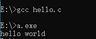

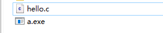

上述过程的说明

```
编译器将代码从文本翻译成二进制指令的过程，就称为编译阶段，又称为“编译时”（compile time），跟运行阶段（又称为“运行时”）相区分。
上面命令先使用 gcc 编译器，将源文件 Hello.c 编译成二进制代码。
运行这个命令以后，默认会在当前目录下生成一个编译产物文件 a.exe。执行该文件，就会在屏幕上输出 Hello World 。
```

GCC 的 -o 参数（output 的缩写）可以指定编译产物的文件名

```
//指定生成的可执行文件为app.exe
gcc -o app hello.c
//运行可执行文件
app.exe
```

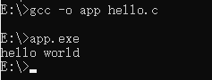

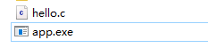

### 2.2.使用IDE编写c语言程序

IDE(Integrated Development Environment，集成开发环境)：相较于文本开发工具，IDE可以把代码编写，编译，执行，调试等多种功能综合到一起的开发工具。

CLion是一款由JetBrains推出的跨平台C/C++集成开发环境（IDE），它具有智能编辑器、CMake构建支持、调试器、单元测试、代码分析等功能,可以极大提高C/C++开发效率。

官网地址：https://www.jetbrains.com/clion

#### 2.2.1 CLion的下载与安装

官方网站

https://www.jetbrains.com/zh-cn/clion/


下载完成后双击运行安装

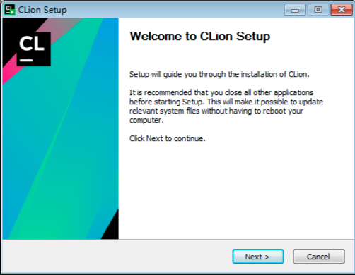

选择安装目录，目录中要避免中文和空格 

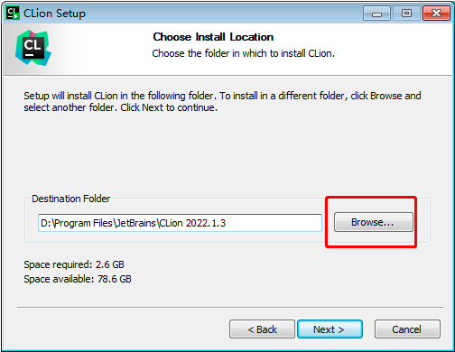

安装配置，创建桌面快捷图标等 ，确认是否与.c、.h、.cpp格式文件进行关联。这里建议不关联。 

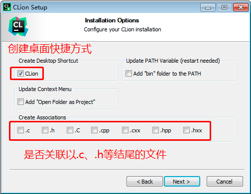

在【开始】菜单新建一个文件夹（这里需要确认文件夹的名称），来管理CLion的相关内容，默认即可。 

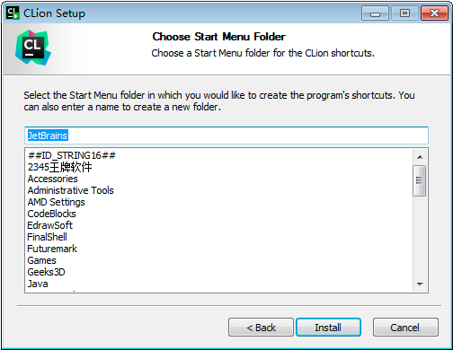

安装完成

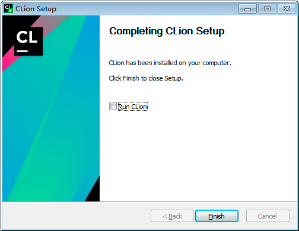

在桌面选择图表，双击运行


选择“Do not import settings”，点击“OK”按钮 

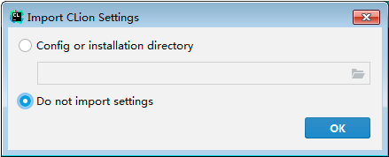

如图所示，需要激活CLion 

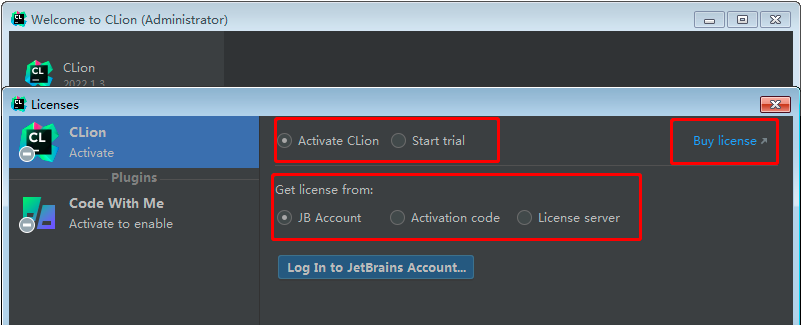

使用破解文件激活

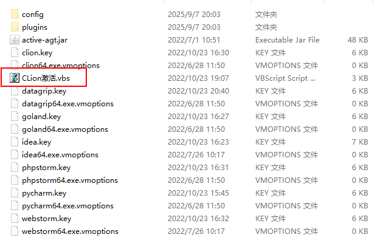


#### 2.2.2 CLion中编写程序

1）选择"New Project"：


2）指定创建C可执行文件、工程目录，图中的“untitled1”需要修改为自己的工程名称。如下所示：

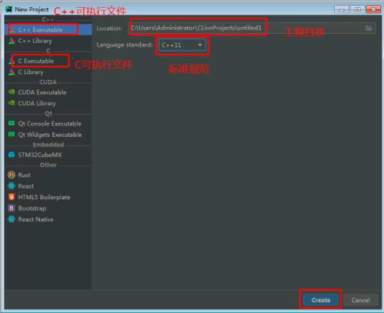


3）选择C可执行文件，修改工程名称为demo1

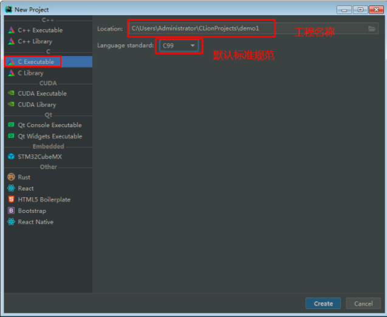


4）点击“Create”进行下一步，如图所示

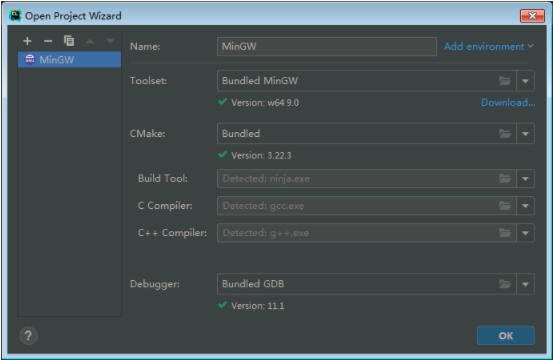


5）此处选择编译器，默认MinGW即可，点击“OK”按钮，如图所示，默认创建了main.c文件。

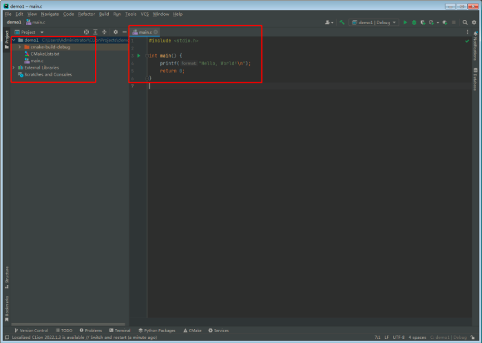


6）点击执行按钮，如下所示

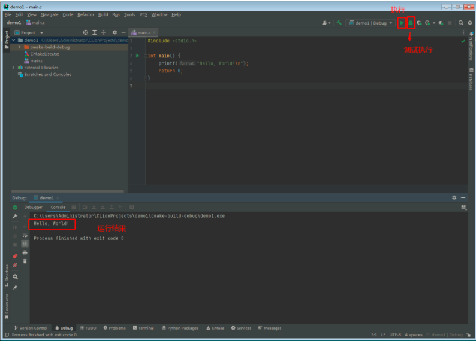

## 3.程序结构说明

```
/* 程序功能：在PC屏幕上显示一串字符 */
#include  <stdio.h>                 //（1）预处理命令：包含输入输出头文件
int main(void)                      //（2）主函数，参数为void表示没有参数
{	
    printf("这是我写的第1个C程序\n"); //（3）调用printf函数，原样输出一串字符
    return  0;                      //（4）如程序正常结束，返回函数值0。可省略。
}
```

> 一个c程序项目，只能有一个main函数

## 4.数据类型和变量

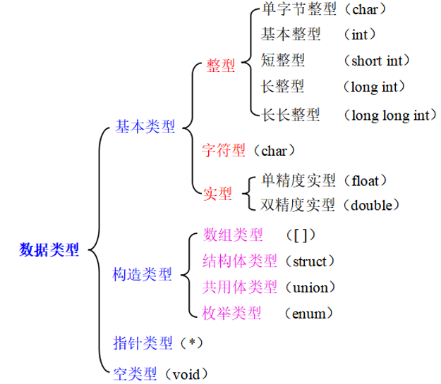

> 数据又有常量与变量两种表现形式，例如整型数据有整型常量和整型变量。


### 4.1.常量

在程序执行过程中，其值不发生改变的量称为常量。根据书写方式，常量可分为直接常量和符号常量。

```
（1）直接常量：如 4、23；1.23； 'a'、'b'；"CHINA"等
（2）符号常量：用#define指令，指定一个标识符代表一个常量。
例如，#define  PI  3.1415926    //定义符号常量PI（代表常量3.1415926）
```

说明：
	标识符是用来标识变量名、符号常量名、函数名、数组名、类型名、宏名、文件名的有效字符序列。C语言的标识符只能**由字母、数字、下画线3种字符组成**，**且第一个字符必须是字母或下划线(开头不能是数字)。**  
	用户定义的标识符不能与系统提供的关键字同名。如int、void等都不能作为用户标识符。另外，标识符区分大小写，如Sum和sum是两个不同的标识符。  

### 4.2.变量

```
在程序执行过程中，其值可以改变的量称为变量。变量必须“先定义，后使用”。定义变量后，编译系统为每个变量名分配对应的内存地址，即一个变量名对应一个存储单元。
int i = 5;
```

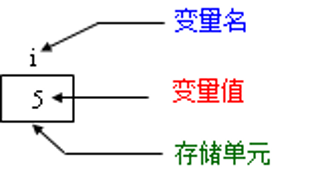


### 4.3.整型数据

#### 4.3.1.整型常量

在C语言中，整型常量（整型常数）有3种表示形式：

（1）十进制整数：如123、－456、7。

（2）八进制整数：以0开头的数。如0123表示八进制数123，对应十进制 83。

（3）十六进制整数：以0x开头的数。如0x123表示十六进制数123，对应十进制 291。 

参见《计算机进制.ppt》

#### 4.3.2.整形变量类型

整型变量的分类，归纳起来，有10种整型变量，对应的数值范围如下： 

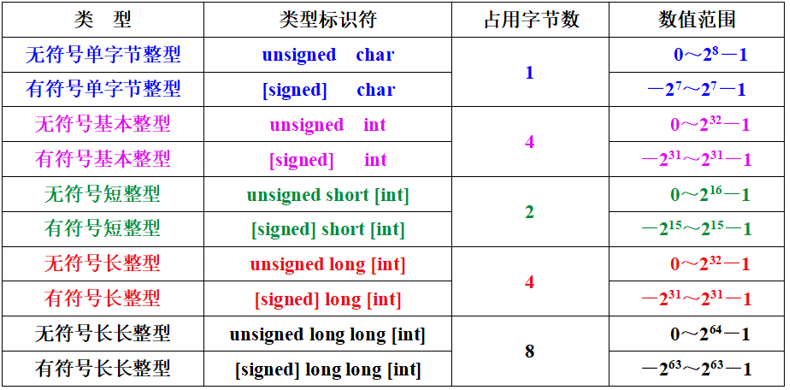

对于int和long在不同系统下会有一些区别

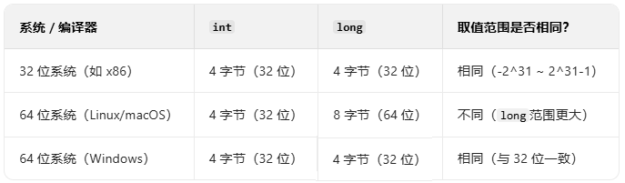


#### 4.3.3.定义整型变量

```
1）定义一个变量的格式：类型标识符  变量名;                  
   例如：int  i;             //定义有符号基本整型变量i
         unsigned int  j;   //定义无符号基本整型变量j

2）同时定义多个同类型变量的格式：
   类型标识符   变量名1，变量名2，变量名3，…;
   例如：int  i, j, k; //同时定义三个基本整型变量i、j、k
   
定义变量后，系统将根据变量的类型给变量分配对应大小的内存空间，用于存储该变量。
```

实例

```
#include  <stdio.h>   //（1）预处理命令：包含输入输出头文件
int main(void)        //（2）主函数
{
    int i;            //（3）定义变量，此时会在内存中开辟空间
    i=1234;           //（4）给变量赋值
    printf("这是我写的第2个C程序\n");    //（5）原样输出一串字符
    printf("i=%d\n", i);               //（6）输出变量的值
}

```

格式化输出函数

```
作用： 向命令行窗口输出若干个任意类型的数据。
一般形式：printf(格式控制字符串, 输出列表) 

括号内包含两部分：
（1）格式控制字符串：由双撇号括起来的一个字符串，它包含两种信息。
① 由%开头的格式符，用于指定数据的输出格式。
 %d：以十进制形式输出带符号整数； 
 %u：以十进制形式输出无符号整数；
 %x：以十六进制形式输出无符号整数； 
 %c：输出单个字符；              
 %s：输出字符串；
 %f：以小数形式输出实数（默认输出6位小数）；
 %e：以指数形式输出实数；
 %%：输出%
② 原样输出的字符，在显示中起提示作用。

（2）输出列表：是需要输出的一些数据，可以是常量、变量或表达式。多个数据之间要用逗号隔开。 
	使用printf函数时，要求格式控制字符串中必须含有与输出项一一对应的格式符，并且类型要匹配。printf函数也可以没有输出项。
	printf("这是我写的第2个C程序\n");    //原样输出一串字符，并换行
	printf("i=%d\n", i);               //原样输出i=，然后以%d形式输出变量i的值，并换行

```

### 4.4.字符型数据

#### 4.4.1.字符常量

用一对单撇号括起来的一个字符，称为字符常量，例如：'A'，'6'，'+' 等。C语言还有一种以 \ 开头的字符序列，称为转义字符（将\后面的字符转换成为另外的含义）。


#### 4.4.2.字符变量

字符变量用来存放字符，并且只能存放1个字符。其类型标识符是char。

```
例如：char c1, c2;    //定义字符变量c1、c2
      c1 = 'a';    
      c2 = 'b';      //给变量c1赋值'a'，变量c2赋值'b'

```

一个字符变量在内存中占一个字节。字符型数据在内存中存储的是该字符对应的ASCII码。 字符型数据的存储形式与单字节整型数据相同。因此，**字符型可以当作单字节整型**。 

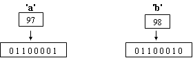

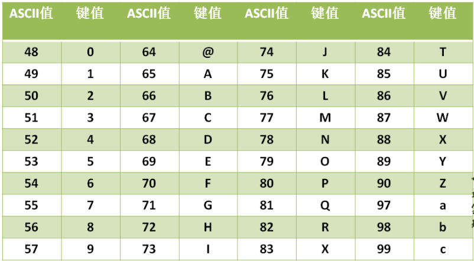


实例1

```
#include  <stdio.h>
int main(void)
{
    char c1;               //定义字符变量
    c1=97;                 //给变量c1赋整数（将ASCII码值97赋给变量c1）
    printf("%c\n",c1);     //以字符形式输出变量c1的值（ASCII码值对应的字符）
    printf("%d\n",c1);     //以整数形式输出变量c1的值（字符对应的ASCII码）
}
```

实例2

```
#include <stdio.h>
int main(void)
{
    char c1, c2;                //定义字符变量
    c1='a';  
    c2='b';                     //给字符变量赋字符常量    
    c1=c1-32;  
    c2=c2-32;                   //将字符变量对应的ASCII码值更新   
    printf("%c,%c\n", c1, c2);  //以字符形式输出变量c1和c2的值    
}
```

### 4.5.实型数据

#### 4.5.1.实型常量

实型常量也称实数，在C语言中，实数有两种表示形式：

（1）十进制小数形式。它由数字和小数点组成（注意，必须要有小数点）。如：0.123、123.、123.0、0.0。  

（2）指数形式。如123e3或123E3都代表123×10^3。要注意字母e（或E）之前必须要有数字，且e后面的指数必须为整数，如e2、4e2.5、.e3、e都不是合法的指数形式。

一个实数可以有多种指数表示形式。在程序中以指数形式输出一个实数时，会以规范化的指数形式输出。 例如123.456的规范化指数形式是1.23456e2。

#### 4.5.2.实型变量

根据数据的数值范围和精度，实型变量的类型主要有单精度（float）型和双精度（double）型。需要注意：实型数据在计算机内存中的存储精度有限，不可能得到完全精确的数值。

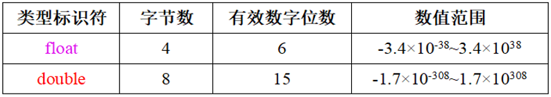

无论是`float`还是`double`，都采用 “符号位 + 指数位 + 尾数位” 的三段式结构，格式如下： 

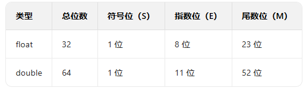

实例

```
#include  <stdio.h>
int main(void)
{	
    float x;                 //定义实型变量x
    x=12.3;                  //将实型常数12.3赋给变量x
    printf("%f\n", x);       //以小数形式输出变量x的数值
    printf("%e\n", x);       //以指数形式输出变量x的数值
}
```

> 1. C 语言标准规定，浮点类型本身默认就可以表示正负值（本质上包含符号位），无需也不允许用 `signed` 显式声明。
> 2. `unsigned` 关键字仅适用于整数类型（如 `int`、`char`、`long` 等），用于表示无符号整数。浮点类型没有无符号版本，因为其存储格式（如 IEEE 754 标准）中符号位是固定存在的，且标准不支持去除符号位的无符号浮点类型。

### 4.6.sizeof运算符

用sizeof运算符可以测试系统中数据类型的存储字节数。

```
sizeof(变量/数据)
```

### 4.7.变量的初始化

C语言规定在定义变量的同时，要对变量赋初值，即变量的初始化。

如果未对变量赋初始值，此时变量值随机，使用未初始化的局部变量可能导致程序输出不确定的结果 。

```
int a=3;                     //定义整型变量a，并赋初值3
float b=1.23;            //定义实型变量b，并赋初值1.23
char c= 'a';              //定义字符变量c，并赋初值'a'

//当一次定义同类型的多个变量时，可以给全部变量或部分变量赋初值。
int a, b, c=5;            //定义a、b、c三个整型变量，只给c赋初值5
int a=1, b=2, c=3;   //定义a、b、c三个整型变量，并赋不同的初值
int a=3, b=3, c=3;   //定义a、b、c三个整型变量，并赋相同的初值3
```

> 注意，对3个变量赋相同的初值3时，不能写成：int a=b=c=3;

### 4.8.常变量

在定义变量并对变量初始化时，如果加上关键字const，则变量的值在程序运行期间不再改变，这种变量称为常变量（constant variable），也称为只读变量。例如：

```
const int a=5;         //用const声明整型变量a为常变量，其值始终是5
```

## 5.运算符

### 5.1.算术运算符及表达式

#### 5.1.1.基本算术运算符

（1）+    加法运算符，或正值运算符，如2+3、+5

（2）-     减法运算符，或负值运算符，如7-2、-4

（3）*    乘法运算符，如2*3 

（4）/     除法运算符，如5/2、5.0/2

（5）%   模运算符，或称求余运算符，%两侧均应为整型数据，如5%2的值为1 	 

> 说明:
>
> 1)参与+、-、*、/ 运算的操作数可以是任意算术类型的数据。若参与运算的两个数中有一个数是实型数据(float型或double型)，系统会自动将这两个数统一转换为实型，然后进行运算，运算结果是double型。
>
> 2)若字符型数据和整型数据进行算术运算时，系统会自动将字符的ASCII码与整型数据进行运算。例如:5+'a'，其运算结果是102。若字符型数据和实型数据进行算术运算时系统将字符的ASCII码转换为double型数据，然后进行运算。
>
> 3)若参与上述5种算术运算的两个数都是整数时，则运算结果也是整数，如5/2的结果为2。

实例: 将两位十进制整数的十位数和个位数分离。

```
#include  <stdio.h>
int main(void)
{
    int a=23, b, c;               //定义a、b、c三个变量
    b = a%10;                     //求变量a的个位数
    c = a/10;                     //求变量a的十位数（/10相当于右移1位）
    printf("a=%d\n", a);          //输出变量a的值
    printf("十位=%d\n", c);       //输出变量a对应的十位数
    printf("个位=%d\n", b);       //输出变量a对应的个位数   
}
```

> 练习:
>
> 1.将一个正整数倒序输出。
>
> 2.用/和%运算符将一个3位和一个4位十进制整数的各位数字分离。

#### 5.1.2.自增自减运算符

自增运算符++：使变量的值自增1，相当于i = i+1。

自减运算符--：  使变量的值自减1，相当于i = i-1。

实例: 自增、自减运算符的应用。

```
#include  <stdio.h>
int main(void)
{
    int i=3, j=3, k=3, x=3;	 
    printf("%d\t", i++);   printf("i=%d\n", i);
    printf("%d\t", ++j);   printf("j=%d\n", j);
    printf("%d\t", k--);    printf("k=%d\n", k);
    printf("%d\t", --x);    printf("x=%d\n", x);
}
```

可见，由自增（自减）运算符构成不同形式的表达式时，对变量而言，自增1（自减1）都具有相同的效果，但对表达式而言却有着不同的值。

> 说明： 
>
> （1）自增、自减运算符只能用于变量，不能用于常量或表达式。如5++或(a+b)++都是不合法的。
>
> （2）自增、自减运算符常用在循环语句中，使循环变量自动加1、减1，这将在后续单元中学习。
>
> （3）如果表达式中有多步运算: 
>
> ​	++在后，先做其他运算，然后再做自增运算
> 	++在前，先做自增运算，然后再做其他运算
>
> ​        自减同理

#### 5.1.3.算术表达式和运算符优先级

算术表达式：用算术运算符和括号将运算对象（常量、变量或表达式）连接起来的、符合C语法规则的式子。例如：a+b*c-5/2+'a'。 

 C语言规定了运算符的优先级。在表达式求值时，先按运算符的优先级高低次序执行，例如：x-y\*z 相当于 x-(y*z)。

> 问题：a+b-c，b先与a相加，还是先与c相减？
>
> 如果在一个运算对象两侧的运算符的优先级相同，则按照规定的“结合方向（结合性）” 处理算术运算符的结合方向为“自左向右（左结合性）”，即先左后右。因此a+b-c 相当于 (a+b)-c。

### 5.2.强制类型转换运算符及表达式

强制类型转换表达式的一般形式：(类型标识符)(表达式)

```
例如:
(int) i         //将i转换为整型
(float)(x+y)    //将x+y的结果转换为float型
(int)x+y        //将x转换成整型后，再与y相加（“(int)”的优先级高于“+”） 
```

实例: 将实型数据强制转换为整型。转换后小数点后内容会丢失（丢失精度）。

```
#include  <stdio.h>
int main(void)
{
    int i;                        //定义整型变量i
    float x=2.4F;                 //定义实型变量x ，并赋初值
    i = (int)x;                   //将实型变量x强制转换为int型 
    printf("x=%f,i=%d\n", x, i);  //输出变量 x 和 i的值
}
```

数值类型转换有几种方式？

（1）系统自动进行的类型转换。如2+3.5，系统自动将整数2转换为实型。

（2）强制类型转换。若i为float型，则i%3不合法，必须用(int)i%3。

### 5.3.赋值运算符及表达式

#### 5.3.1.基础赋值运算符

 简单赋值表达式的形式：变量 = 表达式 

一个表达式应该有一个值，例如 赋值表达式“ a=5” 的值是 5。执行运算后，变量a的值也是5。

> 赋值运算符的优先级仅高于逗号运算符，而低于其他运算符。因此赋值表达式 a=3\*5 等价于 a=(3\*5) ，i=a+b 等价于 i=(a+b)。

赋值表达式中的“表达式”，又可以是一个赋值表达式。根据附录C，赋值运算符是按照“自右向左”的结合顺序。因此 a=b=5 与 a=(b=5) 等价。

分析下面各赋值表达式中变量a的值。

```
a=b=c=3       //3
a=5+(c=7)     //12
a=(b=2)+(c=5) //7
a=(b=6)/(c=2) //3
```

#### 5.3.2.复合赋值运算符

在简单赋值运算符“=”之前加上其他运算符，可构成复合的赋值运算符。 

```
a+=3   等价于a = a+3
a-=3   等价于a = a-3
a*=3   等价于a = a*3
a/=3   等价于a = a/3
a%=3   等价于a = a%3
a*=b+2 等价于a = a*(b+2) 对表达式 b+2外加括号，因为“+”的优先级高于“*=”）
```

> 在赋值运算中，需要根据数据的类型和数值的范围为变量指定合适的类型，必要时还需要借助强制类型转换运算符，以防出错。 
>
> 如果赋值运算符“=”两侧的数据类型不一致，但同为数值型数据，在赋值时，系统会自动进行类型转换。

### 5.4.关系运算符及表达式

#### 5.4.1.关系运算符及优先级次序

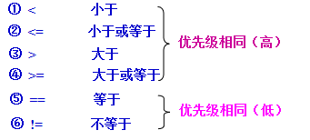

关系运算符的优先级低于算术运算符，高于赋值运算符。

```
例如： 
c>a+b   等价于  c>(a+b)
a==b<c 等价于  a==(b<c)
a>b==c 等价于  (a>b)==c
a=b>c   等价于  a=(b>c)
```

#### 5.4.2.关系表达式

用关系运算符将两个表达式连接起来的式子，称为关系表达式。 

例如： a>b   a+b>c+d  (a=3)>(b=5)  'a'<'b'  a==3  a!=3

关系表达式的值是一个逻辑值：“真”或“假”。例如关系表达式“5==3”的值为“假”，“5>=0”的值为“真”。

关系运算结果，以“1”代表“真”，以“0”代表“假”。

若a=3，b=2，c=1 ，则：

| 关系表达式 | 逻辑值（真、假） | 关系表达式的值（1、0） |
| ---------- | ---------------- | ---------------------- |
| a>b        | 真               | 1                      |
| a>b+c      | 假               | 0                      |
| a!=b+c     | 假               | 0                      |
| a>b>c      | 假               | 0                      |

### 5.5.逻辑运算符及表达式

#### 5.5.1.逻辑运算符

①  &&     逻辑与：连接的表达式全部为真，则结果为真，否则为假

②   ||      逻辑或：连接的表达式有一个为真，则结果为真，否则为假

③    !        逻辑非：对表达式取反

逻辑运算的真值表

| a    | b    | a&&b | a\|\|b | !a   |
| ---- | ---- | ---- | ------ | ---- |
| 真   | 真   | 真   | 真     | 假   |
| 真   | 假   | 假   | 真     | 假   |
| 假   | 真   | 假   | 真     | 真   |
| 假   | 假   | 假   | 假     | 真   |

几种运算符的优先级次序：

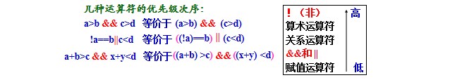

#### 5.5.2.逻辑表达式

C语言规定，参与逻辑运算的操作数以非0代表“真”，以0代表“假”。

逻辑表达式的值，即逻辑运算结果，以数值1代表“真”，以0代表“假”。

例如：

```
（1）若a=3，则!a的值：0
（2）若a=3，b=4，则a&&b的值：1
（3）3&&0||-4的值：1
（4）'a'&&'b'的值：1

```

在逻辑表达式的求解过程中，有时并非所有的运算都被执行，例如：

```
（1）a&&b：只有当a为真（非0）时，才需要判断b的值。
    只要a为假， 就不必判断b的值，此时整个表达式已确定为假。
（2）a||b：只要a为真（非0），就不必判断b的值。只有a为假，才判断b的值。
```

### 5.6.逗号运算符及表达式

逗号表达式的一般形式：  表达式1, 表达式2

逗号运算符的结合性是“从左至右”。求解过程：先求解表达式1，再求解表达式2。整个逗号表达式的值是表达式2的值。

C语言中，在所有运算符中，逗号运算符的优先级最低。

```
例如:
逗号表达式“2+3, 3+5”的值是8。 
表达式“a=2*3, a*5”的值是多少？

#include <stdio.h>
int main(){
    int a;
    int b ;
    b = (a=2*3,a*5);
    printf("%d",b);
    return 0;
}

结果：30
```


### 补充:

整型变量在内存中的存储形式（以单字节整型数据为例）


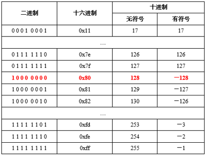

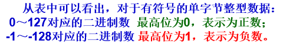


```
- 计算机有符号数据的存储使用二进制补码形式存储，并且最高位是符号位。
  - 正数：最高位是0
  - 负数：最高位是1

- 规定1：正数的补码与反码、原码一样，称为三码合一
- 规定2：负数的补码与反码、原码不一样：
  - 负数的原码：把十进制转为二进制，然后最高位设置为1
  - 负数的反码：在原码的基础上，最高位不变，其余位取反（0变1,1变0）
  - 负数的补码：反码+1

举例：
正数：25   00000000 00000000 000000000 00011001（原码）
正数：25   00000000 00000000 000000000 00011001（反码）
正数：25   00000000 00000000 000000000 00011001（补码）

负数：-25  10000000 00000000 000000000 00011001（原码）
负数：-25  11111111 11111111 111111111 11100110（反码）
负数：-25  11111111 11111111 111111111 11100111（补码）
```

一个字节可以存储的整数范围是多少？

```
//1个字节：8位
0000 0001  ~  0111 111 ==> 1~127
1000 0001 ~ 1111 1111 ==> -127 ~ -1
0000 0000 ==>0

//特殊规定 -128没有原码和反码
1000 0000 ==> -128（特殊规定）=-127-1
```

