# 第2章-程序结构

## 1.数据输入输出函数

（1）从计算机内存向输出设备传送数据称为输出，从输入设备向计算机内存传送数据称为输入。

（2）C语言本身不提供输入输出语句，而用户可以通过调用C标准函数库中的输入输出函数，实现数据的输入和输出。

（3）使用标准输入输出库函数时，要用预处理命令#include将其对应的头文件“stdio.h”包含到源文件中：

```
#include  <stdio.h>
```

### 1.1.字符输出函数

`putchar()` : 向显示器输出一个字符

```
putchar('H');   //输出字符H
putchar('\n');  //换行
char c='X';   
putchar(c);     //输出字符X
```

### 1.2.字符输入函数

`getchar()` : 读取从键盘上输入的一个字符，并在显示屏显示

```
#include  <stdio.h>              //包含输入输出头文件
int main(void)
{ 	
    char c;
    printf("请输入一个字符: ");   //原样输出一串字符，增加人机互动性
    c = getchar();              //从键盘输入一个字符
    putchar(c);                  //在屏幕上显示输入的字符
    putchar('\n');               //换行       
}
```

> 注意：getchar函数只能接收一个字符，输入数字也按字符处理。输入多个字符时，计算机只接收第一个字符。
>
> 如果printf的内容无法显示，需要：刷新缓冲区fflush(stdout);

### 1.3.格式输出函数

`printf()` : 向显示器输出若干个任意类型的数据。

按照格式控制字符串中以%开头的格式符指定的格式，将输出列表中对应的数据输出。也可以没有输出列表项。

```
一般形式：
printf(格式控制字符串,  输出列表) 

printf("这是我写的第2个C程序\n");  //原样输出一串字符，并换行
printf("i=%d\n", i);             //原样输出i=，然后以%d形式输出变量i的值，并换行
printf("%d, %c\n", i, c);        //分别以%d形式和%c形式输出变量i和变量c的值，并换行
```

实例

```
#include  <stdio.h>                                                         //包含输入输出库函数头文件
int main(void)
{
    int   a=5, b=-1;
    float  c=1.2;
    char  d='a'; 
    //依次按指定的格式将多个数据输出    
    printf("a=%d,b=%d,c=%f,d='%c'\n", a, b, c, d);  
    //以十进制格式输出字母a的ASCII码
    printf("字母a的ASCII码 :%d\n", d);   
    //以16进制格式输出字母a的ASCII码
    printf("字母a的ASCII码 :%x\n", d);     
    //输出字符串"CHINA"
    printf("输出字符串:%s\n", "CHINA");     
    //原样输出一串字符
    printf("今年的增长率=");  
    //输出50%
    printf("50%%\n");                                                     
}
```

>  说明：使用printf函数输出数据时，还可在格式符中的%和格式字符之间加入一些修饰符，用于指定输出宽度、小数位数和左端对齐。
>
> 修饰符的顺序：`%[标志][宽度][.精度][长度]格式字符`（如 `%-10.2f` 表示左对齐、宽度 10、保留 2 位小数的浮点数） 

### 1.4.格式输入函数

`scanf()` : 按用户指定的格式从键盘把数据输入到指定的变量地址中。

```
一般形式：scanf(格式控制字符串，地址列表) 
```

（1）格式控制字符串的作用与printf函数类似。     

```
%d：输入有符号的十进制整数
%u：输入无符号的十进制整数
%hhu: 针对无符号字节型数据
%x：输入无符号的十六进制整数
%c：输入单个字符
%s：输入字符串（将字符串送到一个字符数组中）
%f：以小数形式输入单精度实数（%lf用于输入双精度实数）
%e：以指数形式输入单精度实数（%le用于输入双精度实数）
```

（2）地址列表：由若干个地址组成的列表。

变量的地址：地址运算符“&”后跟变量名。多个地址之间要用逗号隔开。

实例:用scanf函数输入多个数值数据

```
#include  <stdio.h>                  //包含输入输出库函数头文件
int main(void)
{
    int  i, j; 
    float  k;
    double  x;
    printf("请输入两个整数和两个实数:\n");   //提示输入4个数据
    scanf("%d%d%f%lf", &i, &j, &k, &x);    //输入4个数据分别赋给4个变量   
    printf("%d,%d,%f,%f\n", i, j, k, x);   //将4个变量的数值输出
}
```

>  说明：用scanf函数一次输入多个数值或多个字符串时，在两个数据之间可用空格或换行符或Tab符作分隔。

实例：用scanf函数输入多个不同类型的数据

```
#include  <stdio.h>
int main(void)
{	
    int i;  char j;	float k;
    printf("请输入1个整数、1个字符和1个实数:\n");     //提示输入3个数据
    scanf("%d%c%f", &i, &j, &k);     //输入3个数据分别赋给变量i、j、k
    printf("%d,%c,%f\n", i, j, k);   //将变量i、j、k的数据输出      
}
```

实例：用scanf函数输入多个字符

```
#include  <stdio.h>
int main(void)
{
    char i, j, k;
    printf("请输入3个字符:\n");      //提示输入3个数据 
    scanf("%c%c%c", &i, &j, &k);    //输入3个数据分别赋给变量i、j、k
    printf("%c,%c,%c\n", i, j, k);  //将变量i、j、k的数据输出
}
```

> 针对输入字符串之后，输入单个字符的问题，需要清理缓冲区
>
> ```
> // 清理缓冲区中残留的换行符（关键修复）
> int c;
> while ((c = getchar()) != '\n' && c != EOF);
> ```

## 2.程序流程图

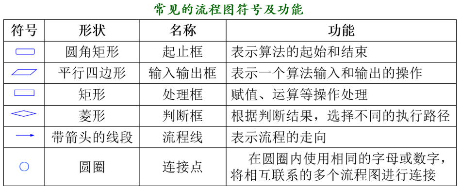


## 3. 程序的三种基本结构

* 顺序结构

  照程序语句书写的顺序一步一步依次执行。

  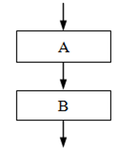

* 选择结构

  根据条件判断的结果，从多种路径中选择其中的一种路径执行。 

  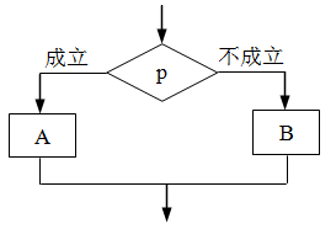

* 循环结构

  将一组操作重复执行多次。有“当型”和“直到型”两种循环结构。 

  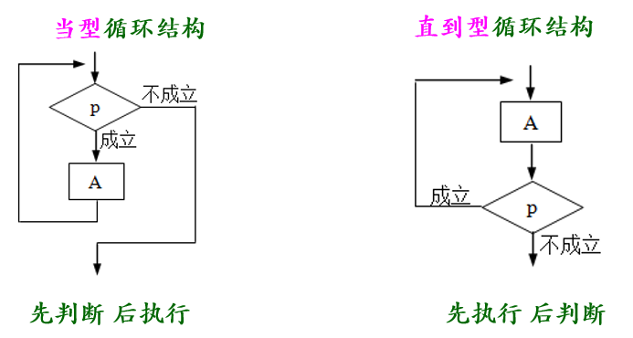

### 2.1.顺序结构

将输入的两个整数交换，然后再输出这两个整数。

需要借助一个临时变量实现两数的交换。

```
//==================================
//程序功能：输入两个整数，交换后再输出。
//==================================
#include  <stdio.h>                       //包含头文件
int main(void)
{
    int  x, y, t;                         //定义三个变量
    printf("请输入两个整数(用空格隔开): ");
    scanf("%d%d", &x, &y);                //输入两个数据给x和y
    t=x;  x=y;  y=t;                      //将数x和y交换
    printf("将输入的两个整数交换之后： ");
    printf("%d %d\n", x , y);             //输出x和y两个数
}

```

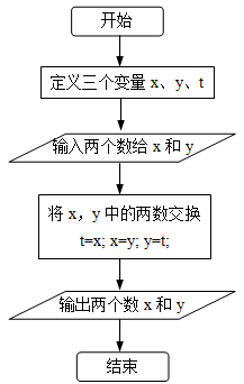

### 2.2.选择结构

选择结构程序：根据不同的条件，执行不同的语句（根据不同的条件选择不同的道路）。两种选择语句：if语句和switch语句。

#### 2.1.if分支

**（1）if基本形式：if(表达式)  语句**

考试成绩不低于60分时，输出“恭喜，通过”。

```
#include  <stdio.h>
int main(void)
{
    int score;
    printf("请输入成绩: "); 
    scanf("%d", &score);
    if(score>=60)   
      printf("恭喜，通过！\n");
}
```

输入两个整数，要求按由大到小的顺序输出。

```
#include  <stdio.h>
int main(void)
{
    int a, b, t;
    printf("请输入两个整数(用空格隔开)：");
    scanf("%d%d", &a, &b);
    if(a<b)
    {	
        t=a;   a=b;   b=t;	
    }
    printf("由大到小：%d,%d\n", a, b);
}
```

**（2）if…else基本形式**

```
if(表达式)  
	语句1;
else             
	语句2;
```

用if…else语句判断考试结果。

```
#include  <stdio.h>
int main(void)
{	
    int score;
    printf("请输入成绩: "); 
    scanf("%d", &score);
    if(score>=60)   
    	printf("恭喜，通过！\n");
    else                   
    	printf("未通过，继续努力！\n"); 
}

```

**（3）if…else嵌套形式**

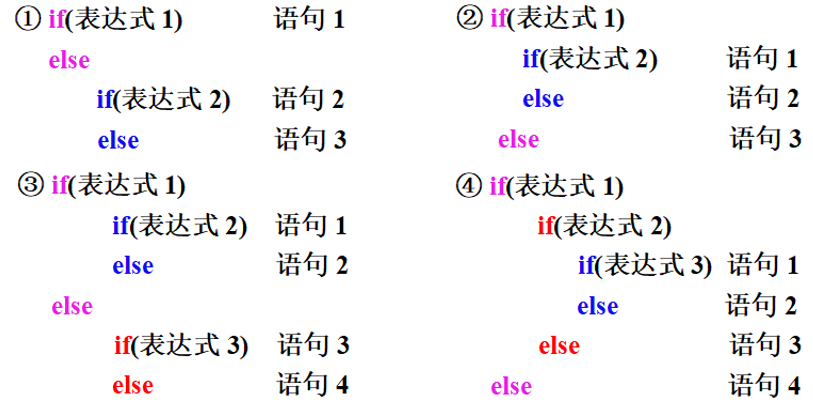

> 说明：注意if与else的配对关系。else总是与它上面最近的未配对的if配对。

**（4）if…else if...else嵌套形式**

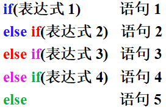


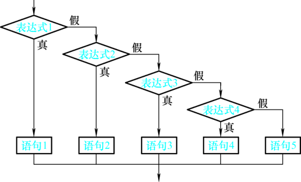

实例：根据输入的课程成绩（整数），判断并输出对应的等级。

输入成绩与输出结果：90～100，优秀； 80～89， 良好；70～79， 中等； 60～69， 及格；0～59，  不及格；其他值， 输入有误!

```
#include  <stdio.h>
int main(void)
{
    int score;
    printf("请输入课程成绩（整数）：");
    scanf("%d", &score);
    if(score>=90 && score<=100)     printf("优秀！\n");	
    else if(score>=80 && score<90)  printf("良好！\n");
    else if(score>=70 && score<80)  printf("中等！\n");
    else if(score>=60 && score<70)  printf("及格！\n");
    else if(score>=0 && score<60)   printf("不及格！\n");
    else                            printf("输入有误！\n");
}

```

**（5）条件运算符**

条件运算符（三目运算符 ?:）和条件表达式 

```
if(a>b)  
	max=a;
else       
	max=b;

可简写为:
max = (a>b)?a:b;
```

条件表达式的一般形式：表达式1 ? 表达式2 : 表达式3

（1）条件运算符的运算优先级低于关系运算符和算术运算符，但高于赋值运算符。因此，max = (a>b)?a:b  等价于  max = a>b?a:b 

（2）条件运算符的结合方向是自右至左。 a>b?a:c>d?c:d   等价于  a>b?a:(c>d?c:d)  

#### 2.2.switch语句

处理多分支选择问题时，可采用if…else嵌套形式，还可采用switch语句。 

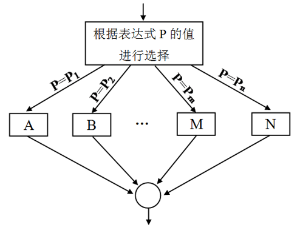

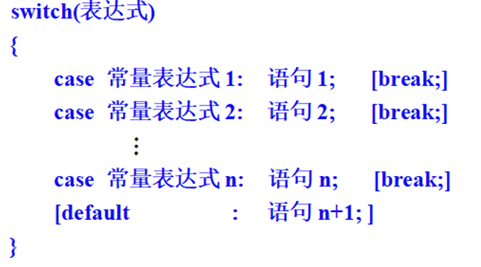

表达式说明：

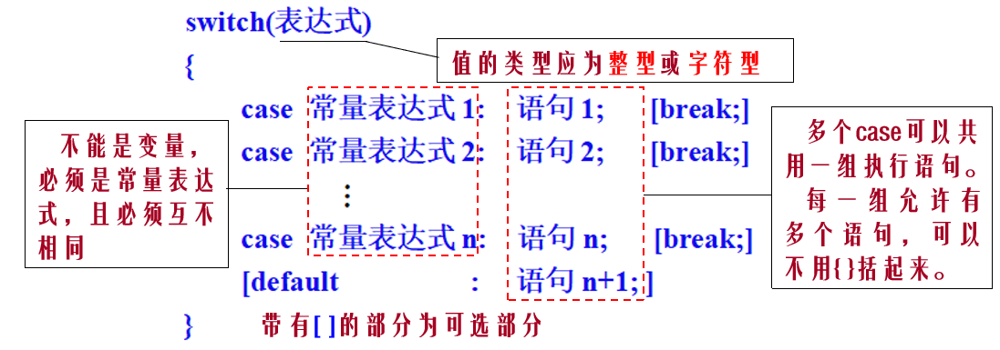

>  当switch括号内“表达式”的值与某个case后面“常量表达式”的值相等时，即执行该行对应的语句，后面的break语句可用来终止switch语句的执行。若switch括号内“表达式”的值与所有case后面的“常量表达式”均不相等时，则执行default后面的语句。

实例：用switch语句实现：根据输入的课程成绩（整数），判断并输出对应的等级。 

``` 
#include  <stdio.h>
int main(void)
{  
    int  score;
    printf("请输入课程成绩（整数）：");
    scanf("%d", &score);
    if(score>=0 && score<=100)
    {
        switch(score/10)
        {  
            case 10: 
            case  9:   printf("优秀！\n");  break;
            case  8:   printf("良好！\n");  break;
            case  7:   printf("中等！\n");  break;
            case  6:   printf("及格！\n");  break;
            default:  printf("不及格！\n");
        }
    }
    else
        printf("输入有误！\n");
}
```

### 2.3.循环结构

c语言中基本的循环结构有：while语句、do…while语句、for语句。

#### 2.3.1.while循环

语法

``` 
while(循环条件表达式) 
	循环体语句;
```

> 循环条件表达式一般是关系表达式或逻辑表达式，只要循环条件表达式的值为真（非0），即可继续执行循环体语句。如嵌入式系统软件的主函数一般用while(1)构成无限循环结构。

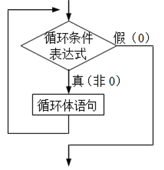

实例：用while语句实现1+2+3+ … +100的和。

```
#include  <stdio.h>
int main(void)
{
    int i=1, sum=0;
    while(i<=100) 
    {	
        sum = sum+i;
        i++;
    }
    printf("sum=%d\n", sum);
}
```


#### 2.3.2.do..while循环

语法：

```
do
  循环体语句
while(表达式)；
```

> do…while循环至少要执行一次循环体语句

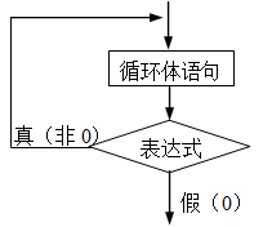

实例：用do…while语句实现1+2+3+ … +100的和。

```
#include  <stdio.h>
int main(void)
{
    int i=1, sum=0;
    do
    {
        sum = sum+i;
        i++;
    }while(i<=100);	 
    printf("sum=%d\n", sum);
}
```

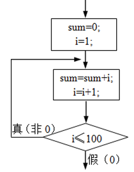

#### 2.3.3.for循环

语法：

```
for(表达式1; 表达式2; 表达式3) 
	循环体语句;

说明：
for(循环变量赋初值; 循环条件; 循环变量变化) 
    循环体语句;
```

> 嵌入式软件设计中常用的两种for语句形式：
>
> （1）for循环体可以是空语句，常用于软件延时。例如：    	
>
> ​          for(i=0; i<1000; i++);   或    for(i=1000; i>0; i--);
>
> （2）for(; ;)与while(1)等价，表示无限循环。主函数一般为无限循环结构。 

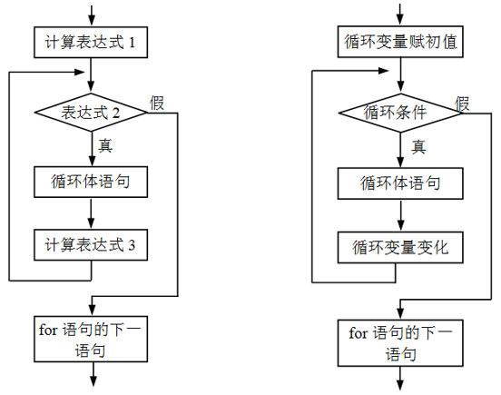

实例：用for语句实现1+2+3+ … +100的和。

```
#include  <stdio.h>       
int main(void)
{ 
    int i, sum=0; 
    for(i=1; i<=100; i++) 
        sum=sum+i; 
    printf("%d\n", sum);
}

```

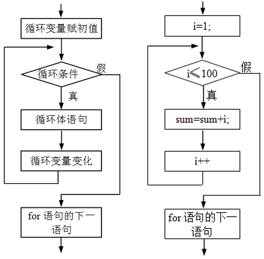

#### 2.3.4.循环嵌套

一个循环体内又包含另一个完整的循环结构，称为循环嵌套。

实例：统计循环次数

```
#include  <stdio.h> 
int main(void)
{
    int i, j;          //定义两个循环变量
    int k=0;           //存放循环次数
    for(i=1; i<=3; i++)
    {
        for(j=1; j<=4; j++)
            k++;
    }
    printf("循环次数：%d\n", k);   
}

```

> 说明：  
>
> （1）这几行代码是一条语句，因此可以不加{ }。
>
> ​          但为了程序的规范性和可读性，建议加{ }
>
> （2）在嵌入式软件设计中，常用此方式实现更长时间的软件延时。 

#### 2.3.5.break和continue

 break语句可提前结束“整个”循环过程。

```
#include  <stdio.h>  
int main(void)
{ 
    int i;
    for(i=1; i<=5; i++)
    {
        if(i==3) break;
        printf("%d\n", i);
    }
}
```

continue语句可提前结束“本次”循环（跳过循环体中下面尚未执行的语句），接着执行下次循环。

```
#include  <stdio.h>  
int main(void)
{ 
    int i;
    for(i=1; i<=5; i++)
    {
        if(i==3) continue;
        printf("%d\n", i);
    }
}
```

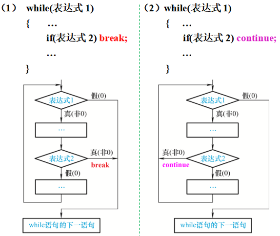

## 4.预处理命令

几乎所有的C语言程序，都使用以“#”开头的预处理命令，例如包含命令#include、宏定义命令#define等。

 C语言中，最常用的3种预处理命令（功能）：文件包含、宏定义、条件编译。需要注意，预处理命令不是C语句。为了与一般C语句相区别，这些命令均以#开头。

当对一个源文件进行编译时，系统将自动引用预处理程序对源程序中的预处理命令做处理，处理完毕自动进入对源程序的编译。

灵活使用预处理命令，可以提高编程效率。

### 4.1.宏定义

1.不带参数的宏定义

两种形式： 

```
（1）  #define   宏名
仅说明宏名对应的标识符被定义。
（2）  #define   宏名   替换文本
用一个简单且见名知意的“宏名”代表“替换文本”，“替换文本”可以是常数、表达式、格式串等。该形式的宏定义可以提高编程效率。

例如：  
#define   PI   3.1415926
在编译预处理时，对程序中所有的宏名“PI”，都用“3.1415926”去替换，此过程称为“宏替换”。
```

2.带参数的宏定义

带参宏定义也称为宏函数。在宏定义中的参数称为形式参数（简称形参），在宏调用中的参数称为实际参数（简称实参）。

```
带参宏定义的一般形式：
#define 宏名(形参表)  替换文本
其中，在替换文本中含有形参表中的各个形参。

带参宏调用的一般形式：  
宏名(实参表)
在宏调用时，不仅要宏展开，而且要用实参去代换宏定义的形参。
```

实例：使用宏定义，根据输入的半径，求圆的面积。

```
#include  <stdio.h>   
#define  PI    3.14159              //宏定义符号常量PI（不带参数）
#define  S(r)  PI*(r)*(r)           //宏定义面积计算公式（带参数）
int main(void)
{  
     float a, area;                 //定义半径、面积变量
     while(1)
     {	
          printf("请输入半径：");		
          scanf("%f", &a);
          if(a<0) break;            //若输入的半径是负值，则退出循环
          area = S(a);              //宏调用
          printf("半径=%6.2f\n", a);
          printf("面积=%6.2f\n", area);
      }
}
```

> 说明：
>
> （1）宏定义不是C语句，不要在行末加分号！
>
> （2）宏定义中的宏名一般都用大写字母。
>
> （3）带参宏定义，对其替换文本中的参数和表达式外加括号是为了不引起歧义，提高程序设计的可靠性。

### 4.2.文件包含

文件包含命令行的一般形式：#include  <文件名>  或   #include  "文件名"

功能：在编译预处理时，将指定的文件插入该命令行位置取代该命令行，从而将指定的文件和当前的源程序文件连成一个源文件。 


> （1）在#include命令中，文件名可以用尖括号或双撇号括起来。例如：	         	      #include   <stdio.h>  或  #include   "stdio.h"       
>
> 一般来说，若要包含的是库函数头文件，则用尖括号；若要包含的是用户自己编写的文件（这种文件一般在用户当前目录中），一般用双撇号。
>
> （2）一个include命令只能包含一个文件，若要包含多个文件，则需要使用多个include命令。
>
> （3）文件包含允许嵌套，即在一个被包含的文件中又可以包含另一个文件。

在程序设计中，可将一些公用的宏定义等单独组成一个文件，在其他文件的开头用包含命令包含该文件即可使用这些公用量。这样可避免在每个文件开头都去书写这些公用量，从而节省时间，并减少出错。

```
例如，若多个源文件均用到下面的宏定义：
#define  PI    3.1415926
#define  S(r)  PI*(r)*(r)
```

可将这些宏定义做成一个公用的文件“common.h”（文件名可灵活设定），其他源文件若需使用这两个宏定义，则只需在该源文件开头处加一行代码即可：  

```
#include  "common.h"
```

### 4.3.条件编译

 可按不同的条件去编译不同的程序部分，因而产生不同的目标代码。这有利于程序的移植和调试。

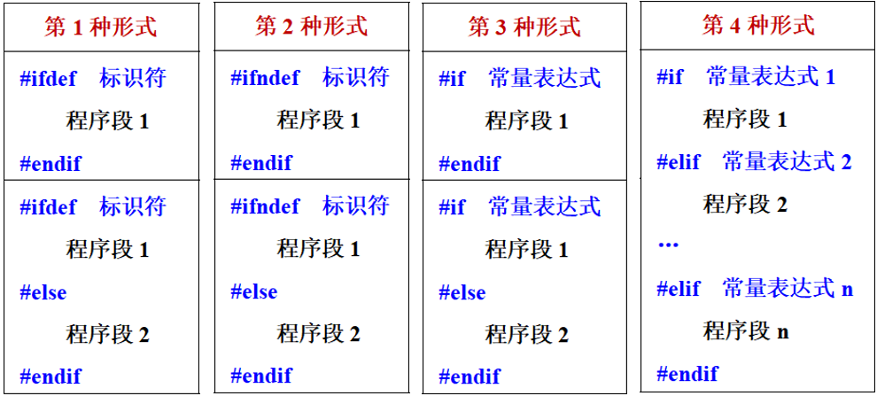

实例：

```c
#include  <stdio.h>     //包含输入输出头文件    
#define  ZK1     9        //宏定义符号常量：商品1的折扣
#define  ZK2     8        //宏定义符号常量：商品2的折扣
#define  ZK3     0        //宏定义符号常量：商品3的折扣
#define  CJ      65        //宏定义符号常量：考试成绩 
int main(void)
{  
  float i=10, j=20, k=30;  //三个商品的原价

  #ifdef  ZK1    //若定义过常量ZK1，则只编译下行代码 //指的是if define
    printf("商品1的价格=%.2f\n", i*ZK1*0.1); 
  #else               //若未定义过常量ZK1，则只编译下行代码
    printf("商品1的价格=%.2f\n", i); 
  #endif

  #ifndef  ZK2   //若未定义过常量ZK2，则只编译下行代码// 指的是if no define
    printf("商品2的价格=%.2f\n", j);   
  #else                //若定义过常量ZK2，则只编译下行代码
    printf("商品2的价格=%.2f\n", j*ZK2*0.1); 
  #endif
  #if  ZK3>0    //若常量ZK3的值大于0，则只编译下行代码
    printf("商品3的价格=%.2f\n", k*ZK3*0.1);  
  #else              //若常量ZK3的值不大于0，则只编译下行代码
    printf("商品3的价格=%.2f\n", k);          
  #endif

  #if  CJ>= 60 && CJ<=100   //若常量CJ值为60～100，则只编译下行代码  
    printf("考试成绩=%d, 通过！\n", CJ);
  #elif  CJ>=0 && CJ<60       //若常量CJ值为0～59，则只编译下行代码
    printf("考试成绩=%d, 不通过！\n", CJ);
  #elif  CJ<0 || CJ>100            //若常量CJ值<0或>100，则只编译下行代码
    printf("考试成绩=%d, 错误！\n", CJ);
  #endif
}
```

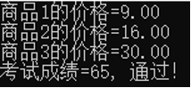


## 5.练习

```
1+..+100的和: for,while,do...while

1-100中输出个位是7的或者是7的倍数的数输出

1-1000回文数: 111,121,131,141,222,212,232...正着读倒着读都一样

1900-2100所有的闰年: 能被4整除，但是不能被100整除，或者能被400整除的就是闰年

1-100之间素数: 除了1和这个数本身，不能被其他任何数整除的数

1-100之间素数,累计到10个时退出

循环输入5个数,求最大最小值

循环输入5个分数，统计80分以上的人数

双重循环输出四个方向的三角形星星:
*
**
***
****
*****

双重循环输出九九乘法表
```

