# 第3章-数组

## 1.一维数组

### 1.1.一维数组的定义

数组是将**相同类型**的若干数据**按序**组合在一起，即**数组是有序同类型数据的集合。**

数组和变量一样，要先定义后使用。

```
定义一维数组的形式：
类型标识符 数组名[常量表达式];
```

> 说明：
>
> （1）类型标识符可以是基本类型 或 构造类型。
>
> （2）常量表达式表示数据元素的个数，也称为数组长度。

例如： int  a[10]; 

该数组有10个整型元素：a[0] ~ a[9]。 元素编号是从0开始。

数组元素的下标=数组元素的位置-1

数组元素位置=数组元素下标+1

系统为数组a分配连续的10个整型内存空间，用来存储10个数组元素。

 C语言规定，数组名可以代表数组的首地址（数组首元素的地址）。

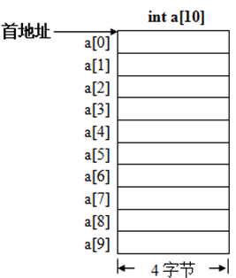

### 1.2.一维数组的初始化

在定义数组时，对数组元素赋初值。初值用{ }括起来，初值之间用逗号隔开。 

```
（1）对全部元素赋初值          
int a[5] = {1, 2, 3, 4, 5};     
结果：a[0]=1，a[1]=2，a[2]=3，a[3]=4，a[4]=5
此时，也可写成：	    
int a[ ] = {1, 2, 3, 4, 5};

（2）对部分元素赋初值          
int a[5] = {1, 2, 3};      
结果：a[0]=1，a[1]=2，a[2]=3，a[3]=0，a[4]=0   
```

> 注意：初值个数不能超过指定的元素个数。
>
> int a[5] = {1, 2, 3, 4, 5, 6}; //错误
>
> 另外，在定义数组之后，不能一次性对整个数组的所有元素赋值，而只能对每个元素逐个赋值。
>
> 例如：
>
> int a[5];                               //定义数组
>
> a[5] = {1, 3, 5, 7, 9};           //错误
>
> a[0]=1; a[1]=3; a[2]=5; a[3]=7; a[4]=9;  //正确

### 1.3.一维数组的引用

C语言规定，只能引用某个数组元素而不能一次引用整个数组的全部元素。 

```
一维数组元素的引用形式：
数组名[下标]
```

> 下标就是数组元素的编号。

实例：将一组数据倒序输出。

```
#include <stdio.h>
int main(void )
{
    int i, a[10];
    for(i=0; i<=9; i++)  
        a[i] = i;
    for(i=9; i>=0; i--) 
        printf("%d ", a[i]);
    printf("\n");
}
```

将数组和循环结构相结合，可有效处理同类型的批量数据，大大提高工作效率。

实例：输入若干个整数，找出其中的最大值。 

```
#include  <stdio.h>
#define  N   5                   //宏定义数据个数
int main(void)
{  	
    int i, max, a[N];
    printf("请输入%d个整数：", N);
    for(i=0; i<N; i++)
        scanf("%d", &a[i]);
    max = a[0];
    for(i=1; i<N; i++)
        if(a[i] > max)    max = a[i];
    printf("最大值：%d\n", max);
}
```


## 2.二维数组

### 2.1.二维数组的定义

我们可用1个一维数组存放1名同学的语文、数学、英语3门课的成绩，而如何存放多名同学的语文、数学、英语3门课成绩呢？ 

在C语言中，可用二维数组解决此类问题。在嵌入式软件设计中，二维数组可用于点阵显示码、液晶显示码等编码的存取。

```
定义二维数组的一般形式：	
类型标识符   数组名[常量表达式1][常量表达式2];
```

> 其中，常量表达式1表示行数，常量表达式2表示列数。

```
例如：   
int a[3][4];     //定义3行4列的整型数组，共有3×4个元素
```

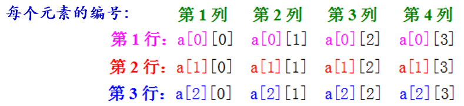

C语言中，又可以把二维数组a看作是一个特殊的一维数组。

它有3个行元素：a[0]、a[1]、a[2]，而每个行元素又是一个包含4个列元素的一维数组，此时把a[0]、a[1]、a[2]看作一维数组名。

```
例如第一行元素：a[0][0]    a[0][1]    a[0][2]    a[0][3] 
```

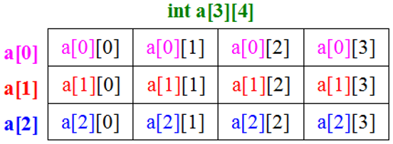

系统会为数组a分配连续的12个整型内存空间，用来存储12个数组元素。

在C语言中，二维数组中元素排列的顺序是按“行”存放的，即在内存中先顺序存放第1行的元素；再顺序存放第2行的元素；最后顺序存放第3行的元素。

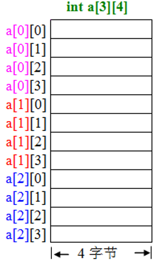

### 2.2.二维数组初始化

在定义二维数组时，对其元素初始化赋值。

```
（1）分行给二维数组赋初值（一行对应一个花括号）
     例如：int a[3][4] = {{1,2,3,4}, {5,6,7,8}, {9,10,11,12}}; 
（2）将所有数据写在一个花括号内，按顺序给元素赋初值
     例如：int a[3][4] = {1,2,3,4, 5,6,7,8, 9,10,11,12};
     效果与第（1）种方法相同，但不如第（1）种方法直观。
（3）可只给部分元素赋初值。例如：int a[3][4] = {{1}, {5}, {9}};
（4）对全部元素都赋初值时，行数可以不指定，但列数不能省略。
     例如：int a[ ][4] = {1,2,3,4, 5,6,7,8, 9,10,11,12};
```

 特别注意：在定义二维数组之后，不能再一次性对整个数组的所有元素赋值，而只能对数组的每个元素逐个赋值。

```
int a[3][4];                        //定义数组
a[3][4] = {{1,2,3,4}, {5,6,7,8}, {9,10,11,12}};  //错误
```

### 2.3.二维数组的引用

C语言规定，只能引用某个数组元素而不能一次引用整个数组的全部元素。

```
二维数组元素的引用形式：数组名[下标][下标]
```

> 下标就是数组元素的编号。 

实例：二维数组元素的引用，二维数组元素的赋值和输出。 

```
#include <stdio.h>
int main(void)
{
    int a[3][4];                             //定义二维数组
    int i, j;
    printf("请输入12个整数:");
    for(i=0; i<3; i++)                       //二维数组的行
    {
        for(j=0; j<4; j++)                   //二维数组的列
            scanf("%d", &a[i][j]);           //向数组a赋值
    }
    for(i=0; i<3; i++)
    {
        for(j=0; j<4; j++)
            printf("a[%d][%d]=%d\n", i, j, a[i][j]);   //输出数组a的12个元素值
    }
}
```

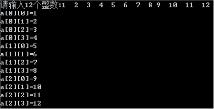 


## 3.字符数组

用来存放字符型数据的数组是字符数组，字符数组中的每个元素存放一个字符。在嵌入式网络通信软件设计中，可用字符数组存放待发送或待接收的数据。

```
例如：
char c[10];
系统为数组c分配连续的10字节内存空间，用来存储10个字符型数据。
数组名c代表该数组的首地址。 
```

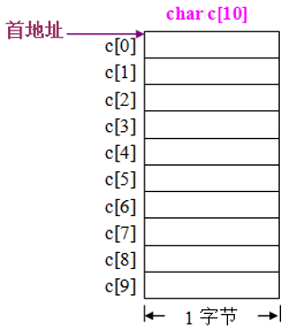

### 3.1.字符数组的初始化

#### 3.1.1.逐个字符赋值法

（1）对全部元素赋初值

```
char c[5] = {'a','b','c','d','e'};
结果：c[0]= 'a'，c[1]= 'b'，c[2]= 'c'，c[3]= 'd'，c[4]= 'e'。
也可写成：char c[] = {'a','b','c','d','e'};
```

（2）对部分元素赋初值

```
char c[6] = { 'a', 'b', 'c', 'd', 'e'}; 
最后1个元素由系统自动赋空字符'\0'。 
```

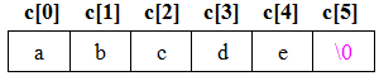

#### 3.1.2.字符串常量赋值法

将字符串常量赋给字符数组：用数组处理字符串

```
char c[] = {"abcde"};
也可写成： 
char c[] = "abcde";
```

字符串常量"abcde"在内存中的存储如下图，因此，它的长度是 6。

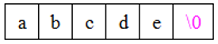

> 下面两种赋值方式是否有区别？如何等价？	       
>
>   ① char c[ ] = {'a','b','c','d','e'};	        
>
>  ② char c[ ] = "abcde";

特别注意：在定义字符数组之后，不能一次性对整个数组的所有元素赋值，而只能对数组的每个元素逐个赋值。

```
例如：
char c[5]; //定义数组
c[5] = {'a','b','c','d','e'};//错误      
c[5] = "abcd";               //错误
```

### 3.2.字符数组的引用

字符数组的引用形式与数值数组相同，可以引用字符数组中的一个元素而得到一个字符。

实例：字符数组元素的引用：输出字符数组元素的值。

```
#include  <stdio.h>
int main(void)
{ 	
    char a[5] = {'a','b','c','d','e'};    //定义字符数组并初始化
    char b[6] =  "12345";
    int i;
    printf("字符数组a:");
    for(i=0; i<5; i++)   
        printf("%c", a[i]);              //字符数组a元素的引用
    printf("\n");
    printf("字符数组b:");
    for(i=0; i<6; i++)   
        printf("%c", b[i]);              //字符数组b元素的引用
    printf("\n");
}
```

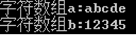

### 3.3.字符数组的输入输出

#### 3.3.1.用格式符“%c”逐个字符输入、输出 

实例：字符数组逐个字符的输入、输出。

```
#include  <stdio.h>
int main(void)
{ 	
    int i;
    char c[5];                 //定义字符数组
    printf("请输入5个字符:");
    for(i=0; i<5; i++) 
        scanf("%c", &c[i]);    //逐个字符输入
    printf("字符数组元素：");
    for(i=0; i<5; i++)   
        printf("%c", c[i]);    //逐个字符输出
    printf("\n");
}

```

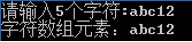

在输入字符时，系统将输入的空格、换行符作为有效字符赋给数组元素。

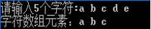

#### 3.3.2.用格式符“%s”对整个字符串一次输入、输出 

实例：字符串的格式化输入、输出 。

```
#include  <stdio.h>
int main(void)
{	
    char str[10];
    printf("请输入字符串:");
    scanf("%s", str);       //输入字符串
    printf("%s\n", str);   //输出字符数组对应的字符串
}
```

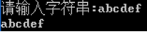

说明：

（1）用“%s”输入、输出字符串时，scanf、printf 中的地址项、输出项都是字符数组名（首地址）。

（2）用scanf 输入字符串时，若输入空格或换行，系统则认为是字符串结束符'\0' 。若输入字符串“abc def”时，运行结果： 

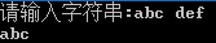

可见，系统只将空格前的字符串“abc”送入数组str中。

## 3.4字符串常用方法

​	在C语言的标准库中给我们写好了一些字符串的功能函数，我们只需要在头文件中写好

```
#include <string.h>
```

​	就可以使用了

### 3.4.1 strlen()-获取字符串长度

​	\lesson3\assets\image-20251019174330524.png)

```
#include <stdio.h>
#include <string.h>
int main() {
//    定义字符串
    char arr[] = "hello";
    int i =0;
//  获取长度逻辑
    while (arr[i]){
        i++;
    }
//任意字符作为结束标识
    printf("%d\n",i);

}

```


### 3.4.2 strcpy()-复制字符串

​	 \lesson3\assets\image-20251019174442246.png)

```
#include <stdio.h>
#include <string.h>
int main() {
//    定义字符串
    char arr[] = "hello";
    char arr2[5];
    int i;
//  复制逻辑
    for(i=0;arr[i];i++){
        arr2[i] = arr[i];
    }
    arr2[i] = '\0';
//任意字符作为结束标识
//输出
    printf("%s\n",arr2);
}

```


### 3.4.3 strcat()-拼接字符串

\lesson3\assets\image-20251019174455170.png)

```
#include <stdio.h>
#include <string.h>
int main() {
//    定义字符串
    char arr[] = "hello";
    char arr1[] = "world";
//  获取长度
    int len = strlen(arr);
    int let1 = strlen(arr1);
//  拼接
    int i=0;
    while (arr1[i]){
        arr[len + i] = arr1[i];
        i++;
    }
//字符结束标识
    arr[len + i] = '\0';
//输出
    printf("%s\n",arr);
    printf("%s\n",arr1);
}

```

### 3.4.4 strcmp()-比较字符串

\lesson3\assets\image-20251019175758624.png)

### 3.4.5 strchr()-查找字符在字符串中的位置

\lesson3\assets\image-20251019183911423.png)

### 3.4.6 strstr()-查找子字符串在字符串中的位置

\lesson3\assets\image-20251019184221163.png)
