# 第4章-函数

## 1.什么是函数

### 1.1.概念

函数是一段封装好的，具有特定功能的代码块，函数本身不会执行，需要调用才可以执行，而且可以调用多次。

将特定功能的代码封装为函数的好处：`实现代码重用，减少冗余，简化代码`。

一个C源程序可以由一个或多个源文件构成（C文件扩展名是“.c”），一个源文件是一个编译单位。一个源文件可以由若干个函数构成，函数之间可以相互调用。也就是说，`函数是C程序基本的组成单位`。

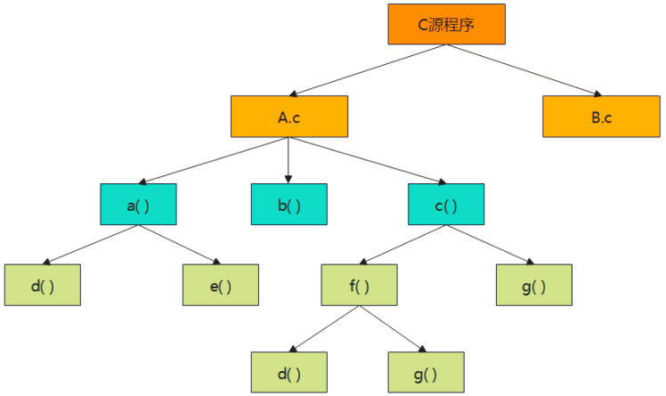

### 1.2.函数分类

**从定义函数的角度**

（1）库函数：由编译系统提供，只要在源文件中包含其对应的头文件，即可在程序中直接调用。例如，“stdio.h”头文件中的printf、scanf等函数，“math.h”头文件中的sin、cos等函数。

（2）用户自定义函数：用户根据需要，将实现某个功能的代码编写成相对独立的函数。

**从有无返回值的角度**

（1）有返回值函数：执行完毕后会向主调函数返回一个值。 

（2）无返回值函数：执行完毕后不向主调函数返回值。 

**从数据传递的角度** 

（1）无参函数：调用时，主调函数和被调函数之间不进行参数传递。 

（2）有参函数：调用时，主调函数需将实参的值传递给被调函数的形参（虚参）。

### 1.3.函数定义

```
定义形式：
//当函数名后的括号中如果写的是void/空 就代表函数本身为无参函数，在调用时无需进行数据的传递
//当函数名后的括号中如果写的是一个参数（参数的类型与名称需要根据需求确定），那么就代表这个函数为有参函数，调用时需要传递参数
类型标识符 函数名(void){
	声明部分
	执行部分
	null
}
```

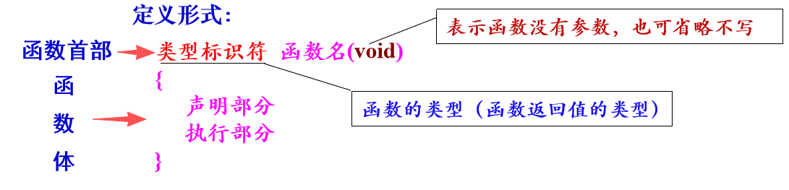


实例:

```
int fun(void)
{	
    int i, j;
    int sum=0;  
    i=2;j=3;       
    sum=i+j;
    retrun sum;  
}	
```

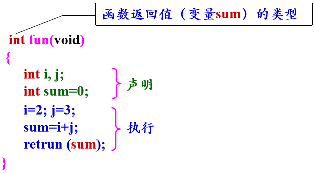

说明:

（1）书写函数体时，一般先写声明部分，后写执行部分。

```
若将前3行写成如下形式，在C89/C90版本中编译不通过，在后面的版本中可以通过
int i, j;     //声明语句
i=2; j=3;     //执行语句
int sum=0;    //声明语句
```

（2）若函数无需返回值，则函数类型应定义为void类型。

```
void Hello( )
{
   printf ("Hello world \n");
}

```

#### 1.3.1.定义有参函数

定义形式：

```
类型标识符  函数名(形参列表)
{
	声明部分
	执行部分
}
```

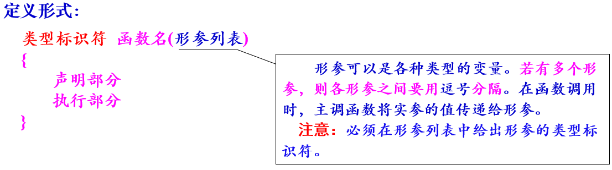

实例1：

```
int max(int x, int y)
{
    int z;
    if (x>y) z=x;
    else z=y;
    return z;
}
```

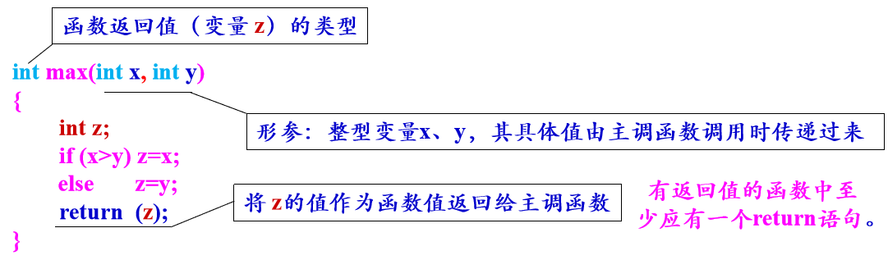

#### 1.3.2.定义有返回值的函数

实例:

```
#include <stdio.h>
#include <stdlib.h>
#include <time.h>

/*
 * 返回指定区间的随机数
 */
int get_random(int start,int end){
    srand(time(NULL));
    int r = rand()%(end-start+1);
    return r+start;
}

int main(){
    int res = get_random(0,2);
    printf("%d",res);
}
```


### 1.4.函数调用

#### 1.4.1.函数的一般调用

函数的一般调用流程：

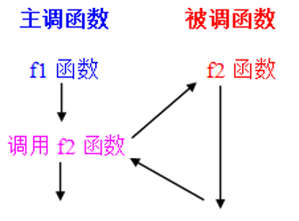

函数被定义之后，即可被其他函数调用。本节将介绍函数的一般调用、嵌套调用和递归调用3种调用方式。

**函数的一般调用形式 :**

（1）无参函数的调用形式：    函数名( )

（2）有参函数的调用形式：    函数名(实参列表)	

调用有参函数时，主调函数将“实参”的值传递给被调函数的“形参”，从而实现信息传递。如果有多个实参，则各参数之间要用逗号隔开。**实参与形参的个数应相等，类型应匹配，按顺序对应，一一传递信息。**

实例：有参函数的一般调用，求两个数的最大值。

```
#include  <stdio.h>
int max(int x, int y);      //对max函数进行声明
int main(void)
{  	
    int a, b, c;
    printf("请输入两个整数: ");
    scanf("%d%d", &a, &b);
    c = max(a, b);        //调用max函数，并接收函数的返回值
    printf("a=%d,b=%d,max=%d\n", a, b, c);   
}

int max(int x, int y)     //定义有参函数
{ 	
    int z;
    if(x>y) z=x;
    else      z=y;
    return  (z);          //向主调函数返回z的值    
}
```

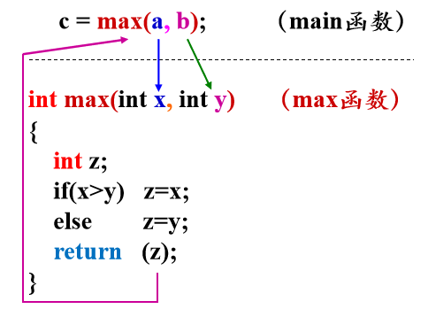

**关于函数调用时“参数传递” 的几点说明:**

（1）形参变量只有在发生函数调用时才被临时分配内存单元。在调用结束后，形参所占用的内存单元也被释放。实参与形参占用不同的存储空间。

（2）只能由实参传递给形参，而不能由形参传递给实参，即“单向信息传递”。在执行一个被调函数时，形参的值如果发生改变，(值传递方式)并不会改变主调函数的实参值。

（3）当形参为普通变量（基本类型的变量）时，实参可以是常量、变量或表达式，但必须有确定的值。

实例：

```
#include  <stdio.h>
void fun(int x, int y);    //对fun函数进行声明
int main(void)
{	
    int a=1, b=3;
    fun(a, b);             //调用fun函数，函数无返回值，无需接收
    printf("a=%d,b=%d\n", a, b); 
}
void  fun(int x, int y)    //定义有参函数
{   	
    x=x+1;   y=y+1;
    printf("x=%d,y=%d\n", x, y);   
}
```

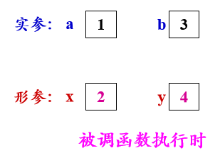


**对于函数的返回值的说明:**

（1）函数的返回值只能通过return语句获得。	

```
return语句的一般形式：  
return  表达式;    
或    
return   (表达式);
```

>  说明：在函数中可有多个return语句，但每次调用只能有一个return 语句被执行，因此只能返回一个函数值。return语句也可以不含表达式，此时必须将函数定义为void类型，其作用只是使流程返回到主调函数。

（2）函数返回值的类型和定义函数时指定的函数类型应保持一致。定义函数时若不指定函数类型，C编译系统则默认为整型。

```
int fun1(){
    ...
    //返回值的数据类型要与函数定义的类型一致
    return 整数返回值;
}

double fun2(){
    ...
    return 浮点型返回值;
}

int main(){
    //调用函数，如果函数有返回值，可以定义变量接收函数的返回值
    int a = fun1();
    double b = fun2();
}
```

（3）没有返回值的函数，函数的类型应当明确定义为void类型。

**对被调函数的声明:**

在上述案例的主调函数（主函数）的前面，都对被调函数进行了声明。若不进行声明，编译系统对程序从上到下进行编译的过程中，遇到被调函数名时，就会认为是一个“陌生人”而报告错误。解决办法有两个。

（1）在主调函数的函数体的开始，或者在源文件中所有函数的前面，对被调函数进行声明。提前向编译系统“打招呼”，让编译系统“提前认识”被调函数。        

```
函数声明（也称为函数原型）的一般形式：
        类型标识符   函数名(形参类型1  形参名1，形参类型2  形参名2, …);  
或：
        类型标识符   函数名(形参类型1，形参类型2,  …);  
```

> 在函数首部的基础上加一分号

（2）若在主调函数前面定义被调函数，则无须额外对被调函数进行声明。

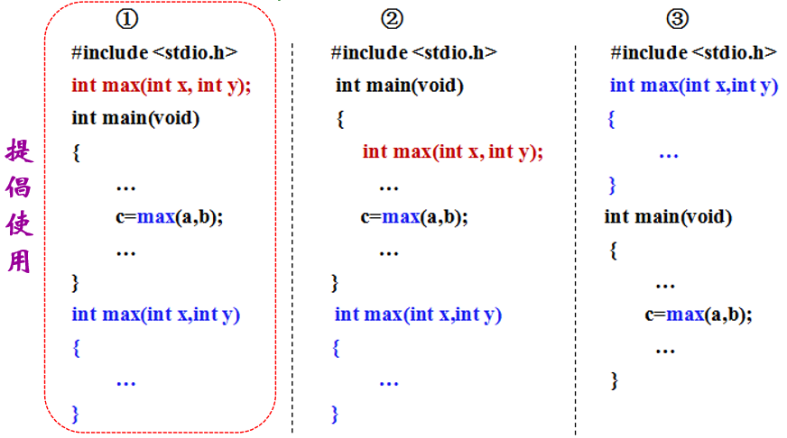

> 说明：调用库函数时，无需对其进行声明，但要把该函数对应的头文件用#include命令包含在源文件中。

#### 1.4.2.函数的嵌套调用

  在C语言中，所有函数（包括主函数）都是相互平行、相互独立的。在一个函数内不能再定义另一个函数（函数不能嵌套定义）。但允许在调用一个函数的过程中，又调用另一个函数，即函数的嵌套调用。

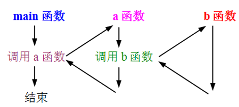

实例：

```
#include  <stdio.h>
void add(float x, float y);     //加法函数声明
void sub(float x, float y);     //减法函数声明
void mul(float x, float y);    //乘法函数声明
void div(float x, float y);      //除法函数声明
void result(float i, float j);   //四则运算函数声明
int main(void)
{	
    float a, b;
    printf("请输入两个实数（用空格隔开）:");
    scanf("%f%f", &a, &b);
    printf("a=%f,b=%f\n", a, b);
    result(a, b);                //调用result函数
}

void result(float i, float j)    //定义四则运算函数
{ 
    add(i, j);                   //调用加法函数
    sub(i, j);                   //调用减法函数
    mul(i, j);                   //调用乘法函数
    div(i, j);                   //调用除法函数
}
void add(float x, float y)      //定义加法函数
{
    printf("add=%f\n", x+y);    
}

void sub(float x, float y)      //定义减法函数
{
    printf("sub=%f\n", x-y);   
}

void mul(float x, float y)      //定义乘法函数
{
    printf("mul=%f\n", x*y);   
}

void div(float x, float y)      //定义除法函数
{   
    printf("div=%f\n", x/y);   
}
```

#### 1.4.3.函数的递归调用

在调用一个函数的过程中，又出现直接或间接地调用该函数本身，称为函数的递归调用。

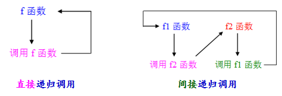

实例：有5个人坐在一起，问第5个人多少岁，他说比第4个人大2岁。问第4个人岁数，他说比第3个人大2岁。问第3个人，又说比第2个人大2岁。问第2个人，说比第1个人大2岁。最后问第1个人，他说他10岁。请问第5个人多大？

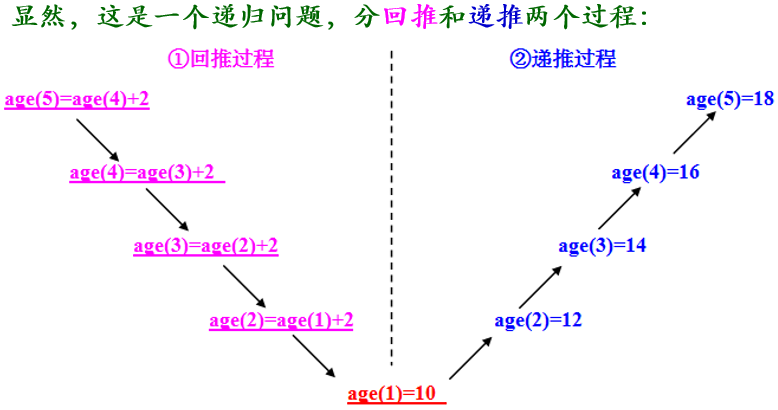

```
#include  <stdio.h>
int age(int n)         //求年龄的递归函数，函数参数：变量n
{	
    int c;          
    if(n==1)  
    	c = 10;
    else   
    	c = age(n-1)+2;   //函数递归调用
    return c;    
}

int main(void)          
{  	
    printf("第5个人的年龄：%d\n", age(5));  //调用age函数    
}
```

> 程序中需要具有一个结束递归过程的条件。age(1)=10，就是使递归结束的条件。

实例：用递归方法计算n的阶乘n!

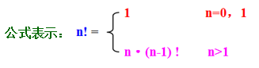

```
#include  <stdio.h>
#include  <stdlib.h>
long long jc(int n)      //求阶乘的递归函数 
{   
    long long x;
    if(n<0) 
    {	
        printf("n<0,输入错误!\n");  
        exit(0);                //终止程序运行
    }
    else
    {	
        if(n==0 || n==1)   
        	x=1;
        else     
        	x = jc(n-1)*n;    //函数递归调用
        return x;    	
    }
}

int main(void)
{   
    int n;
    long long y;
    printf("请输入一个正整数: ");
    scanf("%d", &n);
    y = jc(n);
    printf("%d!=%lld\n", n, y);   //%lld 用于输出长长整型数据
}
```

### 1.5.函数参数

数组用作函数参数有两种形式：1.数组元素作为函数的实参；2.数组名作为函数的实参和形参。 

#### 1.5.1.数组元素为参数

在函数调用时，将实参（数组元素，相当于普通变量）的值传递给形参（变量），实现“单向的值传递”，即`值传递`。 

```
#include  <stdio.h>
void test(int x);                                   //函数声明
int main(void)
{   
    int a[5] = {62, 57, 70, 48, 85}, i;     //将课程成绩存入数组a中
    for(i=0; i<5; i++)
    {
        printf("a[%d]=%d：", i, a[i]);
        test(a[i]);          //调用成绩测试函数，数组元素a[i] 作为实参  	
    }
}

void test(int x)         //成绩测试函数，函数参数：变量x
{   
    if(x>=60)   printf("及格!\n"); 
    else            printf("不及格!\n");     
}
```

#### 1.5.2.数组名为参数

 数组名作为函数参数时，实参向形参传递的信息是数组的首地址，即“单向的地址传递”，也称为`引用传递`。 

数组名作为函数的实参和形参时，应在主调函数和被调函数中分别定义实参数组和形参数组，并且类型要一致，其中形参数组在定义时可以不指定大小。

实例1

```
#include  <stdio.h>
void output(int b[ ], int n);    //函数声明
int main(void)
{	
    int a[5] = {1, 3, 5, 7, 9};
    output(a, 5);                        //调用output函数，实参：数组名a、数值5 
}
void output(int b[], int n)      //形参：数组名b、变量n
{	
    int i;
    for(i=0; i<n; i++)
        printf("b[%d]=%d   ", i, b[i]);     //输出形参数组元素的值
}
```

实例2

```
#include  <stdio.h>
void change(int b[ ], int n);  //函数声明
int main(void)
{	
    int a[5] = {1, 3, 5, 7, 9}, i;
    printf("函数调用前：");
    for(i=0; i<5; i++)
        printf("a[%d]=%d  ", i, a[i]);
    printf("\n");
    change(a, 5);      //调用change函数，实参：数组名a、数值5
    printf("函数调用后：");
    for(i=0; i<5; i++)
        printf("a[%d]=%d  ", i, a[i]);
    printf("\n");      
}

void change(int b[ ], int n)   //形参：数组名b、变量n
{	
    int i;
    for(i=0; i<n; i++)
        b[i] ++;     
}

```

可见，在函数调用之后，实参数组a元素的值发生了变化。其奥秘何在？     

函数调用时，是将实参数组a的首地址传递给形参数组名b，使形参数组名获得了实参数组的首地址，因此形参数组与实参数组为同一数组。

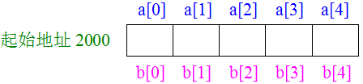

显然，a[i]与b[i]共占同一存储单元，因此当形参数组各元素的值发生变化时，实参数组元素的值也随之变化。 

## 2.变量作用域和存储方式

通过函数可实现模块化程序设计，而每个函数中都会定义和使用一些变量。

从变量的作用域（作用范围）角度，变量可分为局部变量和全局变量。

从变量值存在的时间（生存期）角度，变量有静态存储和动态存储两种存储方式（后面会提到）。

### 2.1.变量的作用域

#### 2.1.局部变量

 在函数或复合语句的内部定义的变量是内部变量，也称为“局部变量”，只在本函数或复合语句范围内有效。

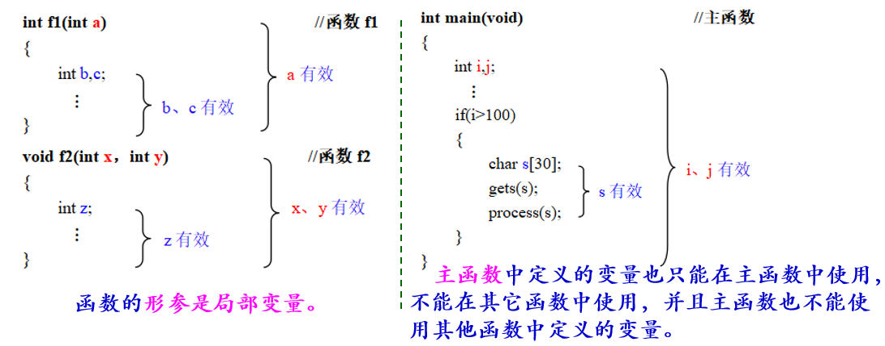

#### 2.2.全局变量

在函数外部定义的变量是外部变量，也称“全局变量”。全局变量的有效范围是从定义变量的位置开始到本源文件结束。 

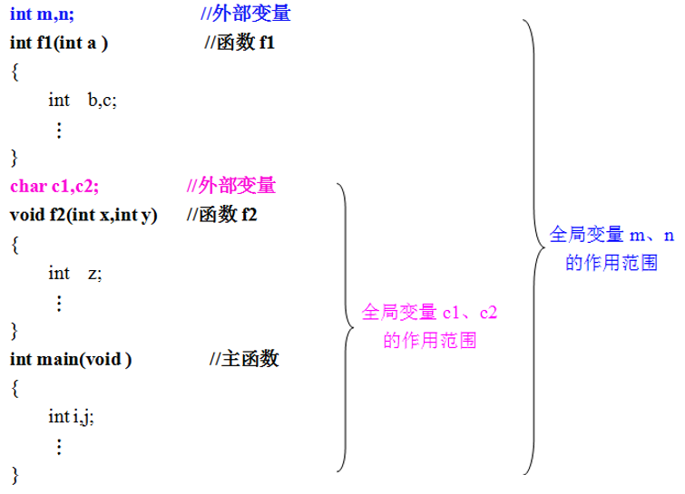

（1）打通函数之间数据联系的通道，使多个函数共享全局变量的值，并且通过函数调用可以得到一个以上的值。 

实例：输入正方体的棱长，输出其表面积和体积的大小。

```
#include  <stdio.h>
float  S,V;               //定义全局变量S和V，分别存放表面积和体积
void sv(float x)       //求正方体的表面积和体积函数
{	
    S = 6*x*x;           //计算表面积
    V = x*x*x;          //计算体积   
}

int main(void)
{	
    float a;               //定义变量a，存放正方体的棱长
    printf("请输入正方体的棱长：");
    scanf("%f", &a);
    sv(a);                 //调用求表面积和体积函数
    printf("棱长=%6.2f,表面积=%6.2f,体积=%6.2f\n", a, S, V);  
}
```

（2）在同一个源文件中，若全局变量与局部变量同名，则在局部变量的作用范围内，全局变量被“屏蔽”失效。 

```
#include  <stdio.h>
int a=1, b=2;              //a、b为全局变量
int add(int a, int b)   //a、b为局部变量
{	
    int  c;
    c = a+b;
    return  (c);
}
int main(void)
{	
    int a=3;                 //a为局部变量
    printf("%d\n", add(a, b));  
}
```

> ​    说明：尽管使用全局变量有时会带来一些便利，但建议不是非常必要的情况下，尽量不要使用全局变量。为了实现程序的模块化设计（函数化），提倡通过“实参-形参”的方式实现函数之间的信息传递，例如数组名作为函数参数。

（3）若定义全局变量时不赋初值，系统会自动赋初值数值0或空字符'\0'。

```
#include  <stdio.h>        
int  a;         //定义全局变量
char b;         //定义全局变量
int main(void) 
{   
    int    i;      //定义局部变量
    char j;      //定义局部变量
    printf("a=%d,b=%c,i=%d,j=%c\n", a, b, i, j);      
}

```

> 若定义局部变量时不赋初值，则系统会为其赋一个随机值。 

