# 第5章-指针

## 1.什么是指针

### 1.1.概念

指针是C语言中广泛使用的一种数据类型。**通过指针，可对计算机的硬件地址直接操作**，在嵌入式软件设计中应用非常广泛。利用指针编写的程序具有精炼、高效的优点；另外，还可以利用指针构成表、树、栈等复杂的数据结构。 

### 1.2.指针的使用

对变量值的存、取都是通过变量的地址进行的。

例如， scanf("%d", &i);    将键盘上输入的数据送给变量i对应的地址单元中。

再如， printf("%d", i);      从变量i对应的地址单元中取出变量i的值。

直接按照变量名（对应一个内存地址）进行的访问，称为“直接访问”方式。

除了采用“直接访问”方式，还可以采用“间接访问”方式。

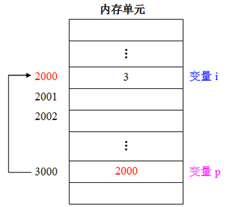

可通过语句“int* p = &i; ” 将变量 i的地址（2000）存放到变量 p中（变量 p的值就是2000）。	

要读取变量 i的值，可以先找到变量 p，从中取出 i的地址(2000)，然后到地址为2000的内存单元取出i的值(3)。

通过变量p能够找到变量i，可以说变量p指向了变量i，在C语言中，将地址形象地称为“指针”。

一个变量的地址，称为该变量的“指针”。例如，地址2000是变量i的指针；而变量p用来存放变量i的地址，称为“指针变量”。

## 2.指针引用普通变量

### 2.1.指针变量的定义

所谓普通变量，是指基本数据类型（整型、实型、字符型）的变量。

```
//整形
int a;
//实型
float b;
double c;
//字符型
char e;
```

变量的指针就是变量的地址。存放变量地址的变量是指针变量，用来指向另一个变量。    

```
定义指针变量的一般形式：  
类型标识符 *变量名；   
```

例如：

```
int *p1;      // p1是指向整型变量的指针变量
float *p2;    // p2是指向实型变量的指针变量 
char  *p3;    // p3是指向字符变量的指针变量 
//你定义的是什么类型的指针变量，该指针变量就只能指向相同类型的变量，取存储与它相同类型的变量的地址

```

> 注意：一个指针变量只能指向同类型的变量，如 p2 只能指向实型变量，不能指向字符变量。

请牢记：指针变量中只能存放地址（指针）。    

两个有关的运算符：

（1）`&`：取地址运算符。

（2）`*`：指针运算符（或称“间接访问”运算符），取其指向单元的内容。

```
例如：
&i 表示变量 i 的地址（2000），
*p 表示指针变量p所指向的存储单元的内容（即 p所指向的变量 i的值 3）。
```

### 2.2.指针变量的引用

实例：通过指针变量访问整型变量。

```
#include  <stdio.h>
int main(void)
{ 	
    int a=10, b=20;
    int *p1, *p2;              //定义两个指针变量，均指向整型变量
    p1 = &a;                    //取变量a的地址，赋给指针变量p1
    p2 = &b;                    //取变量b的地址，赋给指针变量p2
    printf("a=%d,b=%d\n", a, b);
    printf("a=%d,b=%d\n", *p1, *p2);   //输出指针变量指向单元的内容
    printf("变量a的地址：%x\n", p1);   //输出变量a的地址
    printf("变量b的地址：%x\n", p2);   //输出变量b的地址
}
```

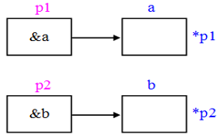


说明：

（1）如下定义方式等价

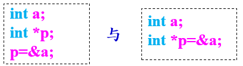

（2）不能直接将一个地址常数赋给一个指针变量，只有强制类型转换后才能赋值：             

 int \*p = 0x12345600;                 //错误             

 int \*p = (int \*)0x12345600;       //正确	

（3）注意“*p”在定义和引用中的区别：       

定义时：\*p的前面要有类型标识符，表示指针变量 p是指向某种类型数据的；       

引用时：\*p的前面没有类型标识符，表示指针变量 p所指向的存储单元的内容。

（4）理解如下代码   

```
 int a;	   
 int *p = &a；
 则&*p 和 *&a的含义分别是什么？
 “&”和“*”优先级相同，并按“自右至左”的结合性。
① &*p：先执行 *p，表示变量a，再执行&运算。因此 &*p与&a相同，
                即变量a的地址（p）。
② *&a：先执行&a，表示变量 a的地址，也就是变量 p，再执行*运算。
                 因此*&a与*p等价，即变量a。

```

实例：输入两个整数，按由大到小的顺序输出这两个整数。

```
#include  <stdio.h>
int main(void)
{	
    int a, b;
    int *p1, *p2, *p;
    printf("请输入两个整数（用空格间隔）：");
    scanf("%d%d", &a, &b);
    p1 = &a;     
    p2 = &b;
    if(a<b) 	
    {	
        p=p1;    
        p1=p2;    
        p2=p;   //交换指针变量的指向
    }
    printf("由大到小：%d,%d\n", *p1, *p2);
}
```

交换前：

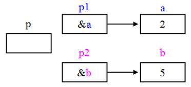

交换后：

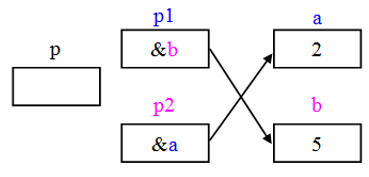


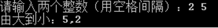

### 2.3.指针作为函数参数

指针变量作函数参数，其作用是将一个变量的地址传递到另一个函数中。

实例：指针变量（变量的地址）作为函数参数。

```
#include  <stdio.h>
void fun(int *p1, int *p2);  //函数声明
int main(void)
{ 	
    int a=1, b=5;
    int *pa = &a, *pb = &b;     //定义指针变量
    printf("调用fun函数前：a=%d,b=%d\n", a, b);
    fun(pa, pb);                     //调用fun函数，指针变量作函数实参
    printf("调用fun函数后：a=%d,b=%d\n", a, b);
}
void fun(int *p1, int *p2)   //指针变量作形参
{	
    (*p1)++;          //使 p1指向的变量值加1
    (*p2)++;          //使 p2指向的变量值加1      
}
```

指针变量作为函数参数，在函数调用时，传递的是变量的地址（地址传递），使实参和形参指向同一个内存单元。当形参指向单元的值发生变化时，实参指向单元的值也随之变化。

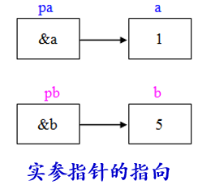

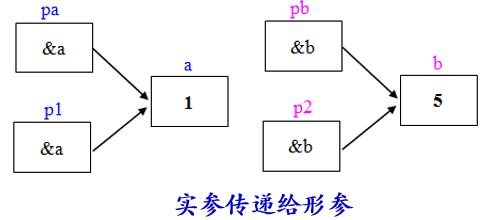

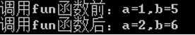


实例2：若想通过函数调用得到n个要改变的值，可在主调函数中设n个变量，将这n个变量的地址传递给被调函数的形参（指针变量）。

```
#include  <stdio.h>
void fun(int *p);            //函数声明
int main(void)
{ 	
    int a;
    fun(&a);                //调用fun函数，变量的地址作实参
    printf("a=%d\n", a);  
}
void fun(int *p)            //指针变量作形参
{	
    *p = 3;                //使指针变量p所指向单元的内容为3
}
```

## 3.指针引用数组元素

### 3.1.数组指针的基本用法

 指针变量既然可以指向变量，当然也可以指向数组元素（把某一元素的地址放到一个指针变量中）。

```
int a[10]；     //定义a为包含10个整型数据的数组
int *p；          //定义p为指向整型数据的指针变量
p = &a[0];      //使p指向a[0]元素    

下面两个语句等价：
int *p = &a[0];   
int *p = a;
```

>  p、a、&a[0]均代表数组a的首地址（a[0]的地址）。 

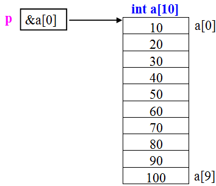

如果指针变量p已指向一维数组中的一个元素，则p+1指向同一数组中的下一个元素，p-1指向同一数组中的上一个元素。

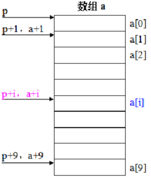

如果p的初值为&a[0]，则：    

（1）p+i 和 a+i 就是a[i]的地址，即&a[i]。或者说它们指向数组a的第i个元素。 

（2）\*(p+i) 或 \*(a+i)就是p+i或a+i所指向的数组元素，即a[i]。例如，\*(p+5)或\*(a+5)就是a[5]。即\*(p+5)、\*(a+5)、a[5]三者等价。实际上，在编译时，对数组元素a[i]就是按\*(a+i)处理的，按a+i计算a[i]的地址，因此[ ]实际上是变址运算符。

（3）指向数组的指针变量也可以带下标，如p[i]与\*(p+i)等价。

### 3.2.数组指针的使用方式

 引用一维数组元素有两种方法：下标法：a[i]。指针法：\*(a+i)或\*(p+i)

实例：输出数组中的全部元素。

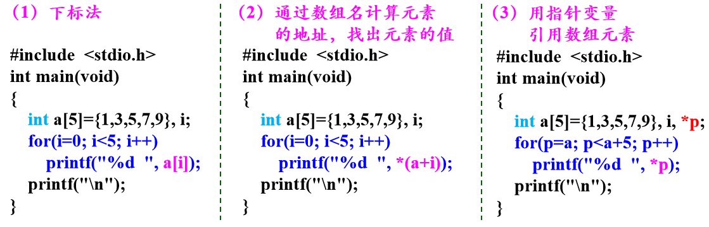

> 顺序访问数组元素时：第（3）种方法比第（1）、（2）种方法快，用指针变量直接指向元素，不必每次都重新计算地址。这种有规律地改变地址值（p++）能大大提高执行效率。

在使用指针变量引用数组元素时，要特别注意：    

（1）可以通过改变指针变量的值（如p++）而指向不同的元素。而a++是错误的，因为a是数组名（数组的首地址），是常量。

（2）要注意指针变量的当前值。

实例：通过指针变量输入和输出数组a的5个元素。

```
#include <stdio.h>
int main(void)
{	
    int i, a[5];
    int *p=a;
    printf("请输入5个整数：");
    for(i=0; i<5; i++)
        scanf("%d", p++);
    for(i=0; i<5; i++, p++)
        printf("%d  ", *p);
    printf("\n");    
}
```

结果：

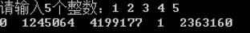

 从运行结果看，没有实现要求。原因何在？如何改正？

```
这段代码存在指针越界访问的问题，导致第二个循环无法正确输出数组元素，具体分析及改造方案如下：
指针 p 的指向在第一个循环后发生了偏移，导致第二个循环访问了错误的内存：
初始时 p 指向数组 a 的首地址（p = a，即 &a[0]）。
第一个 for 循环中，p 每次自增（p++），循环结束后，p 已指向数组 a 的末尾之后（即 &a[5]，超出数组范围）。
第二个 for 循环继续使用 p++ 访问，此时 p 从 &a[5] 开始向后移动，访问的是数组之外的非法内存，输出结果为随机值（未定义行为）。
```

需在第二个循环前将指针 `p` 重新指向数组的首地址，确保访问范围正确。 

```
#include <stdio.h>
int main(void)
{	
    int i, a[5];
    int *p = a;  // 初始指向数组首地址
    printf("请输入5个整数：");
    
    // 第一个循环：输入数据（p会偏移到数组末尾）
    for(i = 0; i < 5; i++)
        scanf("%d", p++);
    
    // 重置p为数组首地址，否则第二个循环会越界
    p = a;
    
    // 第二个循环：输出数据（从首地址开始遍历）
    for(i = 0; i < 5; i++, p++)
        printf("%d  ", *p);
    printf("\n");    
    return 0;
}
```

实例：通过指针变量找出数组元素的最大值和最小值。

```
#include <stdio.h>
int main(void)
{	
    int a[5] = {23, 12, 34, 78, 55};
    int *p, *max, *min;             //定义3个指针变量
    p=max=min=a;                    //将3个指针变量同时指向数组首元素
    for(p=a; p<a+5; p++)
    {	
        if(*p > *max)  max=p;      //更新max指向
        if(*p < *min)   min=p;     //更新min指向
    }
    printf("max=%d,min=%d\n", *max, *min);
}
```

### 3.3.数组首地址做为函数参数

实际上，C语言编译系统都是将形参数组名作为指针变量（存放地址）来处理的，并非真正开辟一个新的数组空间。 

```
void f(int b[ ], int n) 
相当于： 
void f(int *b,  int n) 
```

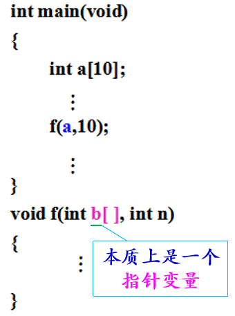

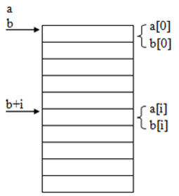

 普通变量、数组元素，普通变量的地址、指针变量、数组名都可以作为函数参数:

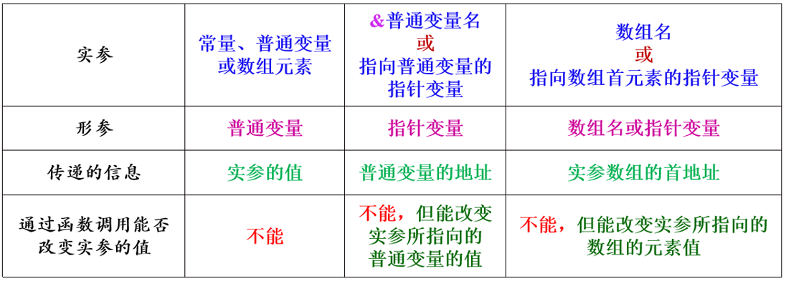

在主调函数中若有一实参数组，则主调函数的实参和被调函数的形参，有4种形式: 

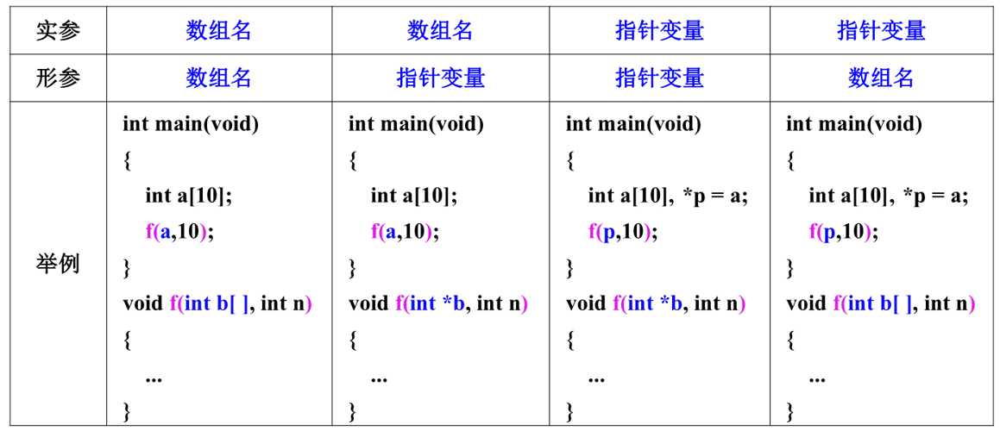

实例：用指针变量作函数形参

```
#include  <stdio.h>
void change(int b[ ], int n);   //函数声明
int main(void)
{	
    int a[5]={1, 3, 5, 7, 9}, i;
    printf("函数调用前：");
    for(i=0; i<5; i++)
        printf("a[%d]=%d  ", i, a[i]);
    printf("\n");
    change(a, 5);       //调用change函数，实参:数组名a、数值5
    printf("函数调用后：");
    for(i=0; i<5; i++)
        printf("a[%d]=%d  ", i, a[i]);
    printf("\n");    
}

void change(int  *b , int n)   //形参:指针变量b、变量n
{	
    int *p;
    for(p=b; p<b+n; p++)
        (*p)++;    
}
```

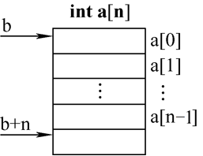

### 3.4.指针引用二维数组

C语言中，二维数组又可看作是一个特殊的一维数组。有3个行元素：a[0]、a[1]、a[2]，而每个行元素又是一个包含4个列元素的一维数组，此时把a[0]、a[1]、a[2]看作一维数组名。

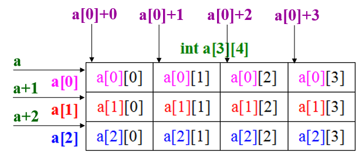

​        根据一维数组的指针知识，a+i代表元素a[i]的地址&a[i]，而在二维数组中，元素a[i]是包含4个元素的一维数组，因此a+i代表i行的首地址（起始地址）。

​        a[0]、a[1]、a[2]既然是一维数组名，而数组名代表数组首元素的地址，因此a[0]代表一维数组a[0]中第0列元素的地址，即&a\[0\][0]。同理，a[1]代表&a\[1\][0]，a[2]代表&a\[2\][0]。据此，a[i][j]的地址&a\[i\][j]可用a[i]+j表示。

> 说明：a[i]与*(a+i)等价 ！

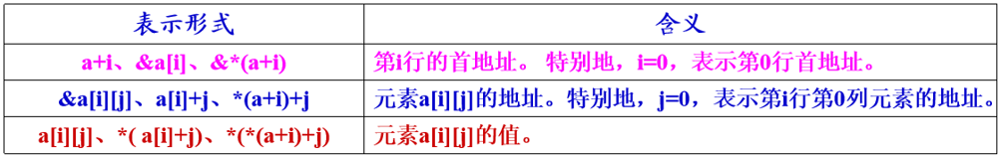

（1）a与a[0]指向同一个地址，区别： a指向一维数组，而a[0]指向a[0][0]元素。a+1中的“1”代表一行中全部整型元素所占的字节数（VC中为16字节），而a[0]+1中的“1”代表一个整型元素所占的字节数（VC中为4字节）。

（2）在行指针(a+i)的前面加一个*，就转换为列指针（指向第i行第0列元素）。例如，而*a、*(a+1) 分别指向数组第0行第0列的元素、第1行第0列的元素。

在列指针a[i]前面加&，就成为指向第i行的行指针。例如，&a[0]是指向第0行的行指针。


实例：用指向数组元素的指针变量输出3×4二维数组各元素的值。

分析：二维数组的元素在内存中是按行顺序存放的，12个元素的地址依次为a[0]～a[0]+11，因此可以用一个指向二维数组元素的指针，依次指向各个元素。 

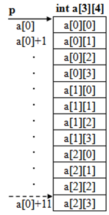

```
#include  <stdio.h>
int main(void)
{	
    int a[3][4] = { {2,4,6,8}, {10,12,14,16}, {18,20,22,24} };
    int *p = a[0];                //将a[0][0]元素的地址赋给指针变量p
    for( ; p<a[0]+12; p++)
    {	
        if((p-a[0])%4 == 0)	 
            printf("\n");       //每输出4个值换行
        printf("%4d", *p);   	
    }
    printf("\n");
}
```

## 4.指针引用字符串

字符串广泛应用于嵌入式系统与物联网软件设计中，本节主要介绍字符串的引用方式和字符串在函数间的传递方式。

### 4.1.字符数组法

实例：用字符数组存放一个字符串，然后输出该字符串和第4个字符。

```
#include <stdio.h>
int main(void)
{	
    char str[ ] = "I love China!";    //定义字符数组str
    printf("%s\n", str);                   //用%s格式输出str整个字符串
    printf("%c\n", str[3]);              //用%c格式输出一个字符数组元素
}
```


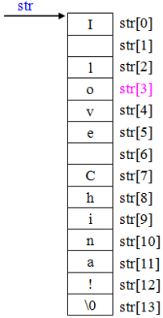

### 4.2.字符指针法

在C语言中，用字符数组来存放字符串常量。因此可将字符串首元素（第1个字符）的地址赋给一个指针变量，通过指针变量来访问字符串，该指针就是指向字符串的指针。

实例：用字符指针变量输出一个字符串和该串的第4个字符。

```
#include  <stdio.h>
int main(void)
{	
    char *p = "I love China!";   //定义字符指针变量p，并使其指向字符串的第1个字符
    printf("%s\n", p);                //输出整个字符串
    printf("%c\n", *(p+3));       //输出第4个字符
}
```

> 使用%s输出时，先输出指针变量p所指向的一个字符，然后自动使p加1，使之指向下一个字符，再输出一个字符，…，直到遇到字符串结束标志'\0'为止。

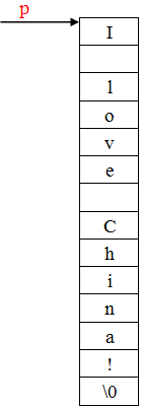

实例：输出字符串中n个字符后的所有字符。

```
#include  <stdio.h>
int main(void)
{	
    int n=10;
    //定义字符型指针变量，并使其指向字符串的第1个字符
    char *ps = "this is a book";   
    ps = ps+n;
    printf("%s\n", ps);
}

```

### 4.3.字符数组和字符指针区别

用字符数组和字符指针变量都可实现对字符串的存储和运算。区别：

1、存储内容不同

字符数组可存放整个字符串；而字符指针变量只能存放字符串某个字符的地址。

2、赋值方式不同

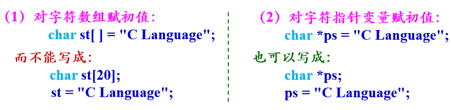

可见，使用指针变量处理字符串更加方便。但要注意：在使用指针变量时，需要对指针变量赋予确定的地址。

可以用下标方式引用指针变量所指向的字符串中的字符。

实例：用带下标的字符指针变量引用字符串中的字符。

```
#include  <stdio.h>
int main(void)
{   
    int i;
    char *p = "I love China!";   //定义字符指针变量p，并使其指向字符串的第1个字符
    for(i=0; p[i] != '\0'; i++)     
        printf("%c", p[i]);            //通过下标方式引用字符串中的字符
    printf("\n");
}
```

### 4.4.字符串在函数间传递

在字符串处理运算中，将一个字符串从一个函数传递给另一个函数时，可用字符数组名或字符指针变量作函数参数，传递字符串的起始地址。


## 5.指针数组

指针数组用来存放一批地址，每一个元素都存放一个地址。

```
定义一维指针数组的一般形式：
类型标识符 *数组名[数组长度];

例如：       
int  *p[3];    
[] 比 * 优先级高，p先与[3]结合，构成p[3]数组的形式，然后再与 * 结合，表示数组p的3个元素均为指向 int型数据的指针变量。
```

实例：利用指针数组指向多个整型变量，并输出各整型变量的值。 

```
#include  <stdio.h>
int main(void)
{	
    int a=10, b=20, c=30, i;
    int *p[3] = {&a, &b, &c};    //定义指针数组并使3个元素分别指向3个整型变量
    for(i=0; i<3; i++)
        printf("%d\n", *p[i]);     //利用指针数组引用整型变量      
}
```

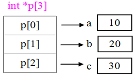

实例：利用指针数组指向一维整型数组的各元素，并引用一维整型数组的各元素。

```
#include  <stdio.h>
int main(void)
{	
    int a[3] = {10, 20, 30}, i;
    int *p[3] = { &a[0], &a[1], &a[2] };   //定义指针数组，并初始化
    for(i=0; i<3; i++)
        printf("%d\n", *p[i]);                    //利用指针数组引用整型数组元素 
}
```

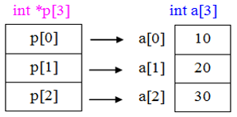

## 6.二级指针

二级指针本质是指向指针的指针。

```
int a=3;
int *num = &a;            //定义指针变量num，指向变量a
printf("%d\n", *num);     //通过指针变量num引用变量a
```

通过指针变量 num间接访问变量a：“单级间址”访问方式。

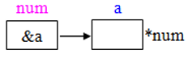

若再定义一个指针变量 p，存放指针变量num的地址，则可通过指针变量 p访问变量 a：“二级间址”访问方式。 

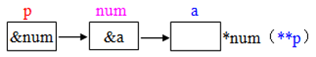

p是指向指针数据的指针变量，简称“指向指针的指针”。

```
定义指向指针的指针变量的一般形式：
类型标识符 **指针变量名;
例如:   
int  **p;  //指针变量p指向一个整型的指针变量
相当于:  
int *(*p); //指针运算符的结合性是从右到左
```

实例：

```
#include  <stdio.h>
int main(void)
{ 	
    int a=3;
    //定义指针变量num,指向变量a
    int *num = &a; 
    //定义指针变量p，指向指针变量num
    int **p = &num;
    //指针变量num的值为变量a的地址
    printf("%x\n", num);
    //*p表示指针变量num的值，即变量a的地址&a
    printf("%x\n", *p);  
    //**p相当于*(*p)，即*&a(变量a的值)
    printf("%d\n", **p);   
}

```

在实际应用中，指向指针的指针常与指针数组配合使用处理问题。

实例：有一指针数组 num，其元素分别指向一维整型数组 a的各元素。现用指向指针的指针变量 p，依次输出整型数组a中各元素的值。

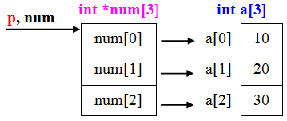

```
#include  <stdio.h>
int main(void)
{	
    int a[3] = {10, 20, 30}, i;
    int *num[3] = {&a[0], &a[1], &a[2]};   //定义指针数组num 
    int **p = num;         //定义指向指针的指针变量p，并指向指针数组num的首元素
    for(i=0; i<3; i++, p++)
        printf("%d\n", **p);  //利用指向指针的指针变量p引用整型数组元素
}

```

## 7.函数指针

### 7.1.函数指针基本使用

编译系统为函数代码分配一段存储空间，其起始地址称为该函数的入口地址。

C规定，函数名代表函数的入口地址，可定义一个指针变量存放函数的入口地址，则该指针称为指向函数的指针，简称函数指针。

实例：用函数求整数a、b的和。 

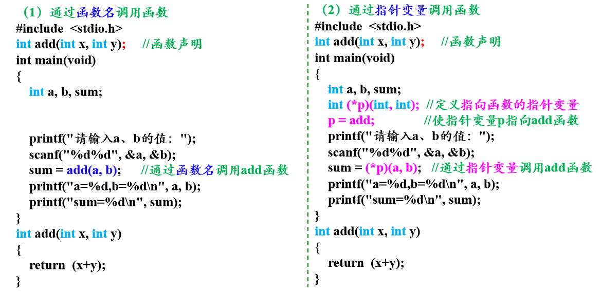

利用指针变量调用函数的步骤和方法：

（1）定义指向函数的指针变量

```
类型标识符  (*指针变量名)(函数参数类型列表) ; 
```

（2）将函数的入口地址（函数名）赋给指针变量，使指针变量指向函数 

（3）通过“(*指针变量名)(函数参数列表)”调用函数 

实例：利用指针调用不同的函数。

```
#include  <stdio.h>
int max(int x, int y)
{ 
    return  (x>y?x:y); 
}
int min(int x, int y) 
{ 
    return  (x<y?x:y); 
}

int main(void)
{   
    int  (*p)(int, int);        //定义函数指针变量
    int a=3, b=2, n; 
    printf("请选择功能号：1-获取最大值；2-获取最小值\n");
    scanf("%d", &n);      //输入功能号
    printf("a=%d,b=%d\n", a, b);
    switch(n)
    {   
        case 1:  
        	p=max;   
        	printf("max=%d\n", (*p)(a, b));   
        	break;
        case 2:  
        	p=min;    
        	printf("min=%d\n",  (*p)(a, b));   
        	break;
    }
}
```

用函数名调用函数，只能调用所指定的一个函数；而通过指针变量可以根据不同情况先后调用不同的函数，使用灵活。

### 7.2.返回指针值的函数

一个函数可以返回指针型的值，即返回一个地址。

```
声明返回指针值的函数（指针型函数），一般形式：
类型标识符  *  函数名(形参列表);

例如：
int * f(int x, int y);

( )优先级高于 *，因此 f 先与( )结合，表示这是f函数。调用该函数之后能得到一个int *型的指针（指向整型数据），即整型数据的地址。
```

实例：利用指针型函数输出字符串

```
#include  <stdio.h>
char * fun1(void)                   //指针型函数，返回指向字符型数据的指针
{	
    char *str = "abcde";            //定义指针变量，并指向字符串常量（位于常量区）
    return  str;                    //返回字符串的起始地址      
}
char * fun2(void)                   //指针型函数，返回指向字符型数据的指针
{	
    static char s[ ] = "12345";    //定义静态局部数组
    return  s;                     //返回静态数组的首地址      
}
int main(void)
{	
    char *ps;                       //定义指针变量
    ps = fun1( );	               //调用fun1函数，获取一指向字符型数据的地址
    printf("%s\n", ps);            //输出ps所指向的字符串 
    ps = fun2( );	               //调用fun2函数，获取一指向字符型数据的地址
    printf("%s\n", ps);            //输出ps所指向的字符串     
}
```

## 8.野指针

### 8.1 什么是野指针

野指针：就是指针指向的位置是不可知（`随机性`，`不正确`，`没有明确限制的`）。

### 8.2 野指针的成因

#### ① 指针使用前未初始化

指针变量在定义时如果未初始化，`其值是随机的`，此时操作指针就是去访问一个不确定的地址，所以结果是不可知的。此时p就为野指针。

```c
int main() {
    int *p;
    printf("%d\n",*p);

    return 0;
}
```

在没有给指针变量显式初始化的情况下，一系列的操作(包括修改指向内存的数据的值)也是错误的。

```c
#include <stdio.h>
int main(){
	int* p;                       
	*p = 10;  
	return 0;
}
```

拓展：注意如下的赋值操作也是错误的

```c
int main() {
    int num = 10;
    int *p;
    p = num;

    return 0;
}
```

#### ② 指针越界访问

```c
#include <stdio.h>

int main() {
    int arr[10] = {0};
    int *p = arr;
    for (int i = 0; i <= 10; i++,p++) {
        *p = i;                   //i=10时越界
    }
    return 0;
}
```


当i=10时，此时`*p`访问的内存空间不在数组有效范围内，此时`*p`就属于非法访问内存空间，p为野指针。

#### ③ 指针指向已释放的空间

```c
#include <stdio.h>

int *test() {
    int a = 10;
    return &a;          //&a=0x0012ff40
}

int main() { 栈
    int *p = test();
    printf("%d", *p);
    return 0;
}
GC 垃圾回收机制
```

调用test函数将返回值赋给p，test函数的返回值是局部变量a的地址。由于a只在test函数内有效，出了test函数其内存空间就被释放，也就意味着`a的地址编号不存在`，若将其赋值给p，导致p获取到的地址是`无效`的。

如果短时间内再次利用这块地址，它的值还未被改变也就是0x0012ff40还存在，p的值为0x0012ff40，*p时还是10，可以打印出。

但如果在打印之前有其他函数调用了这块地址，这块地址的名称就会发生变化，不再是0x0012ff40，打印*p时不再为10。

总之，此时p为野指针。

### 8.3 野指针的避免

**1、指针初始化**

定义指针的时候，如果没有确切的地址赋值，为指针变量赋一个 NULL 值是好的编程习惯。即

```c
int *p = NULL;
```

> 赋为 NULL 值的指针被称为`空指针`，NULL 指针是一个定义在标准库 <stdio.h>中的值为零的常量 **#define NULL 0**

后面如果用到指针的话再让指针指向具有实际意义的地址，然后通过指针的取值符号(*)改变其指向的内容。

练习：

```c
#include<stdio.h>

int main() {
    int *p = NULL; //空指针不要与未初始化的指针混淆

    int b = 8;
    p = &b;   //显式赋值
    *p = 100;
    printf("%d\n", *p);  //100
    printf("%d\b", b);   //100

    return 0;
}
```

**2、小心指针越界**

**3、避免返回局部变量的地址**

**4、指针指向空间释放，及时置NULL**

```c
int a = 10;			
int* pa = &a;
printf("%d\n", *pa);
 
pa = NULL;				//把pa指针置成NULL
 
printf("%d\n",pa);
```

**5、指针使用之前检查有效性**

```c
int *pa = NULL;
if (pa != NULL){
	//进行使用
}

if (pa == NULL){
	//不进行使用
}
```


## 9.const

`const` 是 C 语言中的一个关键字，用于修饰变量、指针、和函数返回值，表示其为常量。常量表示在程序执行过程中不可被修改的值。

### 9.1. **const 修饰变量**

```c
const int MAX_VALUE = 100;
```

这里 `MAX_VALUE` 被声明为一个常量，其值不能被修改。

### 9.2. **const 修饰指针**

```c
const int* ptr;  // 指向常量的指针
int const* ptr;  // 与上面相同，指向常量的指针
int* const ptr;  // 常指针，指向 int 的常指针
const int* const ptr;  // 常指针，指向常量的常指针
```

- `const int*` 或 `int const*` 表示指向常量的指针，指针所指向的值不能通过这个指针被修改。
- 常量只能被常量指针 指向！
- 常量指针也可以指向普通变量，但是此时 仍然不能通过指针去修改该变量。
- `int* const` 表示常指针(**指向不能更改**)，指针本身不能通过赋值修改，但可以通过这个指针修改所指向的值。
- 常指针的侧重点在于 指针的指向不能被改变(指向的是一个变量)，只能初始化赋值一次。
- `const int* const` 表示常指针，指针本身不能通过赋值修改，也不能通过这个指针修改所指向的值。

### 9.3. **const 修饰函数返回值**

```c
const int getValue() {
    return 42;
}
```

这里 `const` 修饰函数返回值，表示函数返回的值不能被修改。

### 9.4. **const 修饰函数参数**

```c
void printMessage(const char* message) {
    printf("%s\n", message);
}
printMessage("hellow");
```

`const` 修饰函数参数，表示函数不会修改传递给它的参数。

## 10.void指针

`void` 指针是一种特殊类型的指针，它可以指向任何类型的数据。在 C 语言中，`void` 表示无类型，因此 `void` 指针不关心所指向对象的类型。这使得 `void` 指针成为一种灵活的手段，能够在不同类型之间传递指针。

以下是 `void` 指针的一些基本用法：

### 10.1**声明和定义 `void` 指针**

```c
void *ptr;
```

这声明了一个 `void` 指针 `ptr`，可以指向任何类型的数据。

### 10.2**使用 `void` 指针**

```c
int num = 42;
float pi = 3.14;

void *ptr;

// 将 void 指针指向 int 变量
ptr = &num;
printf("Value of num: %d\n", *(int *)ptr);

// 将 void 指针指向 float 变量
ptr = &pi;
printf("Value of pi: %f\n", *(float *)ptr);
```

在这个例子中，`ptr` 可以在不同类型的变量之间进行切换。

### 10.3 **作为函数参数**:

```c
void printValue(void *ptr, char type) {
    switch (type) {
        case 'i':
            printf("Value: %d\n", *(int *)ptr);
            break;
        case 'f':
            printf("Value: %f\n", *(float *)ptr);
            break;
        default:
            printf("Unknown type\n");
    }
}

int main() {
    int num = 42;
    float pi = 3.14;

    printValue(&num, 'i');  // 传递 int 类型的指针
    printValue(&pi, 'f');   // 传递 float 类型的指针

    return 0;
}
```

在这个例子中，`printValue` 函数接受一个 `void` 指针和一个表示类型的字符，然后根据类型打印相应的值。

## 11.内存动态分配

全局变量分配在内存中的静态存储区，非静态的局部变量（包括形参）分配在内存中的动态存储区。

除此之外，C语言还允许建立内存动态分配区域，用来存放一些临时用的数据，这些数据不必在程序中的声明部分定义，也不必等函数结束时才释放，而是需要时随时申请开辟，不需要时随时释放。在内存中动态分配的数据，只能通过指针来引用。

对内存的动态分配是通过库函数来实现的，对应的头文件是stdlib.h。

```
1、malloc函数： void * malloc(unsigned size);
    动态申请分配一个长度为size的连续空间。如果分配成功，返回一个指向所分配内存首字节地址的指针；否则返回空指针NULL。
2、calloc函数：  void * calloc(unsigned n, unsigned size);
    动态申请分配n个长度为size的连续空间。如果分配成功，返回一个指向所分配内存首字节地址的指针；否则返回空指针NULL。
3、free函数：      void free(void *p);
    释放指针变量p（最近一次调用malloc或calloc函数时得到的返回值）所指向的动态内存空间，使此空间成为再分配的可用内存。
4、realloc函数： void * realloc(void *p, unsigned newsize);
    把由指针变量p所指向的已分配的内存空间大小变为newsize。如果分配成功，返回指针变量p；否则返回空指针NULL。
```

> `void *`（读作 “void 指针” 或 “无类型指针”）是一种特殊的指针类型，它可以指向**任何数据类型**的内存地址，但本身不与特定的数据类型绑定。 

实例：malloc、calloc、free 函数的应用，动态数组的建立和释放。


实例:realloc函数的应用：增大动态数组的空间。

```
#include  <stdio.h>
#include  <stdlib.h>
int main(void)
{	
    int i, *pn;
    pn = (int *)malloc(5*sizeof(int));           //申请内存空间
    printf("malloc: %x\n", pn);                  //输出申请内存空间的首地址
    for(i=0; i<5; i++)
        pn[i] = i;
    pn = (int *)realloc(pn, 10*sizeof(int));  //重新申请分配内存，扩大空间
    printf("realloc:%x\n", pn);                   //输出重新分配的内存空间的首地址
    for(i=5; i<10; i++)
        pn[i] = i;
    for(i=0; i<10; i++)
        printf("%3d", pn[i]);
    printf("\n");
    free(pn);                                                  //释放空间       
}
```

## 12.指针小结

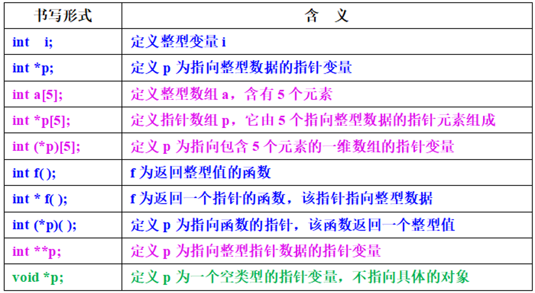

